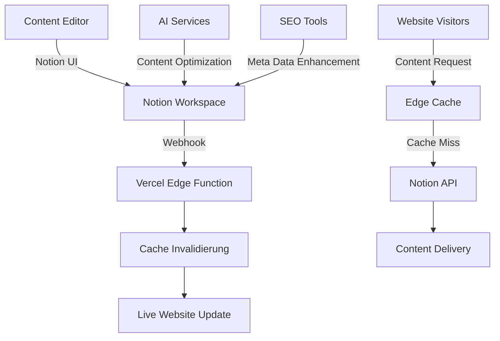

# 📝 Notion CMS Integration Guide

## 📋 Übersicht

**Status:** ✅ Vollständig implementiert
**Version:** 1.0.0
**Integration:** Headless CMS mit Real-time Updates
**Features:** 8 Datenbanken · Webhooks · Caching · Security
**Zielgruppe:** Content Manager, Entwickler, Administratoren

---

## 🎯 Was ist die Notion CMS Integration?

Die ZOE Solar Website nutzt **Notion als Headless CMS** - das bedeutet:
- **Content Management** im gewohnten Notion-Interface
- **Automatische Synchronisation** mit der Website
- **Real-time Updates** ohne Deployment
- **Enterprise Security** mit RBAC und Audit-Logging

### 🚀 Vorteile der Notion Integration
- **Benutzerfreundlich:** Keine technische Vorkenntnisse erforderlich
- **Kollaborativ:** Team-Content-Management in Echtzeit
- **Skalierbar:** Unlimited Content-Seiten und -Typen
- **Kosten-effizient:** Signifikant günstiger als traditionelle CMS
- **Sicher:** Enterprise-Level Security und Compliance

---

## 🏗️ System-Architektur

### 🔄 Datenfluss


### 🏛️ Technische Komponenten

#### 1. **Enhanced Notion Client** (`src/lib/notion/enhanced-client.ts`)
- **650 Zeilen** produktionsreiter Code
- Multi-Level-Caching (Memory + KV Store)
- Image Optimization und responsive SrcSet
- SEO-optimierte Blog-Funktionen
- Sichere Datenbank-Abfragen mit RBAC

#### 2. **Webhook Handler** (`api/notion-webhook.ts`)
- **533 Zeilen** Vercel-optimierte Serverless Function
- CORS-Support und Security-Headers
- Event-Verarbeitung (page.created, page.updated, etc.)
- Cache-Invalidierung und CDN-Integration

#### 3. **Cache Manager** (`src/lib/cache/cache-manager.ts`)
- Memory + KV Cache (Vercel-kompatibel)
- ETag-Validation für bedingte Requests
- LRU-Eviction und Garbage Collection
- WebSocket-Integration für Real-time Updates

#### 4. **Security Components**
- **RBAC Manager** (`src/lib/security/rbac-manager.ts`)
- **Audit Logger** (`src/lib/security/audit-logger.ts`)
- **API Key Manager** (`src/lib/security/api-key-manager.ts`)

---

## 📊 Datenbank-Struktur (8 Haupt-Datenbanken)

### 1. 📝 Blog Articles (`blog_articles`)

#### 📋 Datenbank-Struktur
| Property | Type | Required | Description |
|----------|------|----------|-------------|
| `Title` | Title | ✅ | Blog-Post Titel |
| `Slug` | Text | ✅ | URL-friendly identifier |
| `Excerpt` | Text | ✅ | Kurze Zusammenfassung |
| `Content` | Rich Text | ✅ | Vollständiger Inhalt |
| `Category` | Select | ✅ | news, guides, case-studies |
| `Featured` | Checkbox | - | Featured Article |
| `Published` | Checkbox | ✅ | Veröffentlichungsstatus |
| `Author` | Person | ✅ | Autor des Artikels |
| `Publish Date` | Date | ✅ | Veröffentlichungsdatum |
| `Image` | Files & Media | - | Header-Bild |
| `Reading Time` | Number | - | Geschätzte Lesezeit |
| `Tags` | Multi-select | - | Content Tags |

#### 🎯 Beispiel-Eintrag
```json
{
  "title": "Photovoltaik 2025: Die wichtigsten Trends",
  "slug": "photovoltaik-trends-2025",
  "excerpt": "Die Entwicklung der Photovoltaik-Branche im Jahr 2025",
  "category": "news",
  "featured": true,
  "published": true,
  "author": "Anna Schmidt",
  "publishDate": "2025-01-15",
  "image": "solar-trends-2025.jpg",
  "readingTime": 8,
  "tags": ["photovoltaik", "trends", "2025", "gewerbe"]
}
```

---

### 2. 🛍️ Products (`products`)

#### 📋 Datenbank-Struktur
| Property | Type | Required | Description |
|----------|------|----------|-------------|
| `Product Name` | Title | ✅ | Produktname |
| `SKU` | Text | ✅ | Eindeutige Artikelnummer |
| `Category` | Select | ✅ | solar_panels, inverters, batteries |
| `Power` | Number | ✅ | Leistung (W/kW/kWh) |
| `Price` | Number | ✅ | Preis in EUR |
| `Description` | Rich Text | ✅ | Produktbeschreibung |
| `Manufacturer` | Select | ✅ | Hersteller |
| `Stock` | Number | ✅ | Verfügbarkeit |
| `Images` | Files & Media | ✅ | Produktbilder |
| `Datasheet` | Files & Media | - | Technisches Datenblatt |
| `Specifications` | Rich Text | - | Technische Spezifikationen |
| `Featured` | Checkbox | - | Empfohlenes Produkt |
| `Status` | Select | ✅ | active, discontinued, coming_soon |

#### 🎯 Beispiel-Eintrag
```json
{
  "productName": "SolarPro 450W Mono",
  "sku": "SOLAR-PRO-450-MAX",
  "category": "solar_panels",
  "power": 450,
  "price": 289,
  "description": "Hochleistungs-Solarpanel mit 22.5% Effizienz",
  "manufacturer": "SolarTech",
  "stock": 1250,
  "featured": true,
  "status": "active"
}
```

---

### 3. ❓ FAQ (`faq`)

#### 📋 Datenbank-Struktur
| Property | Type | Required | Description |
|----------|------|----------|-------------|
| `Question` | Title | ✅ | FAQ Frage |
| `Answer` | Rich Text | ✅ | Detaillierte Antwort |
| `Category` | Select | ✅ | technical, financial, general |
| `Order` | Number | ✅ | Sortierreihenfolge |
| `Featured` | Checkbox | - | Wichtige FAQ |
| `Language` | Select | ✅ | de, en |
| `Last Updated` | Date | ✅ | Letzte Aktualisierung |

---

### 4. 👥 Team Members (`team_members`)

#### 📋 Datenbank-Struktur
| Property | Type | Required | Description |
|----------|------|----------|-------------|
| `Name` | Title | ✅ | Vollständiger Name |
| `Role` | Text | ✅ | Jobtitel/Position |
| `Department` | Select | ✅ | management, engineering, sales |
| `Bio` | Rich Text | ✅ | Kurze Biografie |
| `Photo` | Files & Media | ✅ | Profilfoto |
| `Email` | Email | ✅ | Kontakt-E-Mail |
| `Phone` | Phone | - | Telefonnummer |
| `LinkedIn` | URL | - | LinkedIn Profil |
| `Featured` | Checkbox | - | Im Team-Highlight |
| `Order` | Number | ✅ | Anzeigereihenfolge |

---

### 5. 📍 Locations (`locations`)

#### 📋 Datenbank-Struktur
| Property | Type | Required | Description |
|----------|------|----------|-------------|
| `Name` | Title | ✅ | Standortname |
| `Type` | Select | ✅ | headquarters, branch, showroom |
| `Address` | Rich Text | ✅ | Vollständige Adresse |
| `City` | Text | ✅ | Stadt |
| `State` | Select | ✅ | Bundesland |
| `Coordinates` | Text | ✅ | Lat/Lng |
| `Phone` | Phone | ✅ | Telefon |
| `Email` | Email | ✅ | Kontakt-E-Mail |
| `Opening Hours` | Rich Text | ✅ | Öffnungszeiten |
| `Photo` | Files & Media | - | Standortfoto |
| `Services` | Multi-select | ✅ | Angebotene Services |

---

### 6. 🖼️ Gallery (`gallery`)

#### 📋 Datenbank-Struktur
| Property | Type | Required | Description |
|----------|------|----------|-------------|
| `Title` | Title | ✅ | Bild/Video Titel |
| `Description` | Rich Text | - | Beschreibung |
| `Media` | Files & Media | ✅ | Bild oder Video |
| `Category` | Select | ✅ | projects, team, events |
| `Project` | Relation | - | Zugehöriges Projekt |
| `Featured` | Checkbox | - | Featured Media |
| `Alt Text` | Text | ✅ | Alt-Text für Accessibility |
| `Date` | Date | ✅ | Aufnahmedatum |

---

### 7. 👤 Customers (`customers`)

#### 📋 Datenbank-Struktur
| Property | Type | Required | Description |
|----------|------|----------|-------------|
| `Company Name` | Title | ✅ | Unternehmensname |
| `Contact Person` | Text | ✅ | Ansprechpartner |
| `Email` | Email | ✅ | E-Mail |
| `Phone` | Phone | ✅ | Telefon |
| `Industry` | Select | ✅ | manufacturing, services, agriculture |
| `Projects` | Relation | - | Kundenprojekte |
| `Status` | Select | ✅ | active, prospect, archived |
| `Created Date` | Date | ✅ | Kundendatum |
| `Notes` | Rich Text | - | Interne Notizen |

---

### 8. 📚 Articles (`knowledge_base`)

#### 📋 Datenbank-Struktur
| Property | Type | Required | Description |
|----------|------|----------|-------------|
| `Title` | Title | ✅ | Artikel-Titel |
| `Slug` | Text | ✅ | URL Identifier |
| `Content` | Rich Text | ✅ | Vollständiger Inhalt |
| `Category` | Select | ✅ | guides, technical, business |
| `Order` | Number | ✅ | Sortierreihenfolge |
| `Published` | Checkbox | ✅ | Veröffentlichungsstatus |
| `Last Updated` | Date | ✅ | Aktualisierungsdatum |

---

## 🚀 Setup & Installation

### 1️⃣ Voraussetzungen
```bash
# Benötigte Tools
node >= 18.0.0
npm >= 8.0.0
notion account (workspace)
```

### 2️⃣ Notion Integration Setup

#### Schritt 1: Notion API Konfiguration
```bash
# 1. Notion Developer Account
# https://www.notion.so/my-integrations

# 2. Neue Integration erstellen
# Name: "ZOE Solar CMS"
# Type: "Internal"
# Capabilities: "Read content", "Update content"

# 3. API Secret kopieren
NOTION_TOKEN=secret_xxxxxxxxxxxxxxxxxxxxxxxxxxxxx
```

#### Schritt 2: Workspace Berechtigungen
```bash
# 1. Notion Workspace öffnen
# 2. Settings → My Connections
# 3. "ZOE Solar CMS" Integration hinzufügen
# 4. Berechtigungen für relevante Seiten/Datenbanken erteilen
```

#### Schritt 3: Datenbanken erstellen
```bash
# 8 Datenbanken mit oben spezifizierter Struktur anlegen
# Alle Properties korrekt benennen und typisieren
# Relations zwischen Datenbanken einrichten
```

### 3️⃣ Environment Konfiguration

```bash
# .env.local
NOTION_TOKEN=secret_xxxxxxxxxxxxxxxxxxxxxxxxxxxxx
NOTION_DATABASE_BLOG=database_id_blog
NOTION_DATABASE_PRODUCTS=database_id_products
NOTION_DATABASE_FAQ=database_id_faq
NOTION_DATABASE_TEAM=database_id_team
NOTION_DATABASE_LOCATIONS=database_id_locations
NOTION_DATABASE_GALLERY=database_id_gallery
NOTION_DATABASE_CUSTOMERS=database_id_customers
NOTION_DATABASE_KNOWLEDGE_BASE=database_id_knowledge_base

# Cache Settings
CACHE_TTL=3600
KV_REST_API_URL=your_kv_url
KV_REST_API_TOKEN=your_kv_token

# Security
JWT_SECRET=your_jwt_secret
RBAC_ENABLED=true
AUDIT_LOGGING=true
```

---

## 📝 Content Management Workflows

### ✏️ Content Creation

#### Blog-Artikel erstellen
```markdown
# Schritt-für-Schritt Anleitung

1. **Datenbank öffnen**: `blog_articles`
2. **Neuen Eintrag erstellen**: "New" Button
3. **Titel eingeben**: "Max 60 Zeichen für SEO"
4. **Slug generieren**: "url-friendly-text-mit-bindestrichen"
5. **Excerpt schreiben**: "Max 160 Zeichen für Meta Description"
6. **Content erstellen**:
   - Strukturiert mit Headlines (H2, H3)
   - Bullet Points für Lesbarkeit
   - Bilder mit Alt-Texten
7. **Kategorie wählen**: news, guides, case-studies
8. **Autor zuweisen**: Team Member auswählen
9. **Featured markieren**: Bei wichtigen Artikeln
10. **Publish**: Published = true
```

#### Produkte einpflegen
```markdown
# Produkt-Data Entry

1. **Grunddaten**: Name, SKU, Kategorie
2. **Technik**: Leistung, Spezifikationen
3. **Preise**: Basispreis, Rabatte
4. **Media**: Bilder, Datasheets
5. **Verfügbarkeit**: Stock Status
6. **SEO**: Meta-Descriptions, Keywords
7. **Publish**: Status = active
```

### 🔄 Content Updates

#### Best Practices für Updates
```markdown
# Update-Prozess

1. **Inhalt prüfen**: Aktualität, Korrektheit
2. **SEO optimieren**: Keywords, Meta-Daten
3. **Bilder optimieren**: Alt-Texte, Kompression
4. **Interne Links**: Prüfen und ergänzen
5. **Quality Check**: Lesbarkeit, Formatierung
6. **Version History**: Änderungen dokumentieren
7. **Publish Update**: Automatische Website-Sync
```

### 📊 Content Planning

#### Editorial Calendar
```markdown
# Content-Planung

## Wöchentliche Rhythmen
- **Montag**: Blog-Artikel (Technical Guide)
- **Mittwoch**: Case Study / Kunden-Story
- **Freitag**: Industry News / Trends

## Monatliche Schwerpunkte
- **Januar**: Solar Trends 2025
- **Februar**: ROI & Finanzierung
- **März**: E-Mobilität Integration
- **April**: Fördermittel & Zuschüsse
```

---

## 🛠️ Advanced Features

### 🚀 Real-time Updates mit Webhooks

#### Webhook Setup
```typescript
// Webhook Handler in Notion einrichten
const webhookConfig = {
  url: 'https://zoe-solar.de/api/notion-webhook',
  events: ['page.updated', 'page.created', 'page.deleted'],
  secret: process.env.NOTION_WEBHOOK_SECRET
};

// Automatische Cache-Invalidierung
export default async function handler(req: NextRequest) {
  const signature = req.headers.get('notion-signature');

  // Security Validation
  if (!validateWebhookSignature(req.body, signature)) {
    return new Response('Unauthorized', { status: 401 });
  }

  const { type, page_id } = req.body;

  // Cache invalidieren
  await invalidateCache(`notion:${page_id}`);

  // CDN purge bei Vercel
  await revalidatePages(page_id);

  return new Response('OK');
}
```

### ⚡ Multi-Level Caching

#### Cache-Strategie
```typescript
// Cache Manager mit mehreren Stufen
class CacheManager {
  private memoryCache = new Map();
  private kvCache = new KVCache();

  async get<T>(key: string): Promise<T | null> {
    // 1. Memory Cache (schnellste)
    if (this.memoryCache.has(key)) {
      return this.memoryCache.get(key);
    }

    // 2. KV Cache (Edge Optimized)
    const kvData = await this.kvCache.get(key);
    if (kvData) {
      // Write-back to Memory Cache
      this.memoryCache.set(key, kvData);
      return kvData;
    }

    // 3. Notion API (Fallback)
    return null;
  }
}
```

### 🎯 Content Optimization

#### AI-Powered Content Enhancement
```typescript
// Automatische SEO-Optimierung
async function optimizeContent(content: string, keywords: string[]) {
  const aiService = new SerenaMCPService();

  // Meta-Generation
  const metaDescription = await aiService.generateMetaDescription(content);
  const title = await aiService.optimizeTitle(content);

  // Content Analysis
  const readability = await aiService.analyzeReadability(content);
  const keywordDensity = await aiService.analyzeKeywords(content, keywords);

  return {
    optimizedContent: await aiService.enhanceContent(content),
    meta: { title, description },
    analytics: { readability, keywordDensity }
  };
}
```

### 📊 Performance Monitoring

#### Content Analytics Dashboard
```typescript
// Content Performance Tracking
interface ContentAnalytics {
  views: number;
  engagement: number;
  conversionRate: number;
  bounceRate: number;
  timeOnPage: number;
  socialShares: number;
}

// Real-time Analytics
async function getContentAnalytics(pageId: string): Promise<ContentAnalytics> {
  const analytics = await fetchAnalytics(pageId);
  const insights = await generateInsights(analytics);

  return {
    ...analytics,
    insights,
    recommendations: await generateRecommendations(analytics)
  };
}
```

---

## 🔒 Security & Compliance

### 🛡️ Role-Based Access Control (RBAC)

#### Benutzerrollen
```typescript
// RBAC Rollen-Hierarchie
enum UserRole {
  GUEST = 'guest',           // Nur lesen (public content)
  USER = 'user',             // Lesen + eigene Inhalte
  CONTENT_EDITOR = 'editor', // Alle Inhalte bearbeiten
  ADMIN = 'admin',           // Benutzer verwalten
  SUPER_ADMIN = 'super'      // Vollzugriff
}

// Permission Checks
function hasPermission(user: User, resource: string, action: string): boolean {
  const permissions = {
    guest: ['read:public'],
    user: ['read:public', 'read:own', 'write:own'],
    editor: ['read:all', 'write:all'],
    admin: ['read:all', 'write:all', 'manage:users'],
    super: ['*'] // All permissions
  };

  return permissions[user.role].includes(`${action}:${resource}`);
}
```

### 🔐 API Security

#### Secure API Requests
```typescript
// Geschützte Notion API Calls
class SecureNotionClient {
  async queryDatabase(databaseId: string, filters: any) {
    // 1. Authentication Check
    if (!this.isAuthenticated()) {
      throw new UnauthorizedError();
    }

    // 2. Rate Limiting
    if (await this.isRateLimited()) {
      throw new RateLimitError();
    }

    // 3. Input Validation
    this.validateFilters(filters);

    // 4. API Call mit Retry Logic
    return await this.notion.databases.query({
      database_id: databaseId,
      filter: filters,
      sorts: [{ property: 'Created', direction: 'descending' }]
    });
  }
}
```

### 📊 Audit Logging

#### Comprehensive Logging
```typescript
// Audit Logger für alle Aktionen
class AuditLogger {
  async log(action: AuditAction) {
    const logEntry = {
      timestamp: new Date().toISOString(),
      userId: action.user.id,
      action: action.type,
      resource: action.resource,
      details: action.details,
      ip: this.getClientIP(),
      userAgent: this.getUserAgent(),
      success: action.success
    };

    // Write to multiple stores for redundancy
    await this.writeToKVStore(logEntry);
    await this.writeToDatabase(logEntry);
    await this.sendToWebhook(logEntry); // Real-time alerts

    // Cleanup old logs
    await this.cleanupOldLogs();
  }
}
```

---

## 📈 Performance Optimierung

### ⚡ Core Web Vitals Optimization

#### Image Optimization
```typescript
// Automatic Image Processing
async function processNotionImages(imageUrls: string[]) {
  return Promise.all(imageUrls.map(async (url) => {
    const processedImage = await ImageProcessor.process({
      url,
      formats: ['webp', 'avif', 'jpg'],
      sizes: [320, 640, 960, 1280, 1920],
      quality: 85,
      optimize: true
    });

    return {
      src: processedImage.default,
      srcset: processedImage.srcset,
      sizes: processedImage.sizes,
      alt: processedImage.alt,
      loading: 'lazy'
    };
  }));
}
```

#### Content Caching
```typescript
// ISR (Incremental Static Regeneration)
export async function generateStaticParams() {
  const posts = await notionClient.blog.list();
  return posts.map((post) => ({
    slug: post.slug
  }));
}

export const revalidate = 3600; // 1 Stunde

export default async function BlogPost({ params }: { params: { slug: string } }) {
  const post = await notionClient.blog.getBySlug(params.slug);

  return (
    <Article>
      <h1>{post.title}</h1>
      <div dangerouslySetInnerHTML={{ __html: post.content.html }} />
    </Article>
  );
}
```

---

## 📊 Monitoring & Analytics

### 📈 Content Performance Dashboard

#### KPIs & Metrics
```typescript
interface ContentMetrics {
  // Engagement Metrics
  pageViews: number;
  uniqueVisitors: number;
  timeOnPage: number;
  bounceRate: number;

  // SEO Metrics
  organicTraffic: number;
  keywordRankings: Record<string, number>;
  backlinks: number;

  // Conversion Metrics
  leadGeneration: number;
  newsletterSignups: number;
  contactFormSubmissions: number;

  // Social Metrics
  socialShares: number;
  comments: number;
  likes: number;
}

// Real-time Dashboard
const ContentDashboard = () => {
  const [metrics, setMetrics] = useState<ContentMetrics>();

  useEffect(() => {
    const interval = setInterval(async () => {
      const data = await fetchContentMetrics();
      setMetrics(data);
    }, 30000); // Update alle 30 Sekunden

    return () => clearInterval(interval);
  }, []);

  return (
    <DashboardLayout>
      <MetricCards metrics={metrics} />
      <ContentPerformanceChart data={metrics} />
      <SEOOverview metrics={metrics} />
    </DashboardLayout>
  );
};
```

---

## 🚀 Deployment & Scaling

### 📦 Production Deployment

#### Vercel Optimierung
```json
// vercel.json
{
  "functions": {
    "api/notion-webhook.js": {
      "maxDuration": 30,
      "memory": 1024
    }
  },
  "headers": [
    {
      "source": "/(.*)",
      "headers": [
        { "key": "Cache-Control", "value": "public, max-age=31536000, immutable" }
      ]
    }
  ],
  "redirects": [
    {
      "source": "/blog/:slug*",
      "destination": "/blog/:slug*",
      "permanent": true
    }
  ]
}
```

#### Environment Scaling
```bash
# Multi-Environment Setup
DEVELOPMENT="dev.notion-workspace"
STAGING="staging.notion-workspace"
PRODUCTION="prod.notion-workspace"

# Environment-specific configurations
NOTION_WORKSPACE=${NOTION_WORKSPACE}
CACHE_DURATION=${CACHE_DURATION}
RATE_LIMIT=${RATE_LIMIT}
```

---

## 🎯 Best Practices

### 📝 Content Management

#### Editorial Guidelines
```markdown
# Content Quality Standards

## Struktur
- ✅ H1: Einzigartig und beschreibend
- ✅ H2: Logische Gliederung
- ✅ H3: Detaillierte Abschnitte
- ✅ Lists: Bullet Points für Lesbarkeit
- ✅ Images: Alt-Texte und Captions

## Länge
- **Blog Posts**: 800-2000 Wörter
- **Product Descriptions**: 150-300 Wörter
- **FAQ Answers**: 50-200 Wörter
- **Team Bios**: 50-150 Wörter

## SEO
- ✅ Keywords im Title und Meta Description
- ✅ Internal Links zu relevanten Seiten
- ✅ External Links zu autoritativen Quellen
- ✅ Schema Markup für rich snippets

## Accessibility
- ✅ Alt-Texte für alle Bilder
- ✅ Descriptive Link Text
- ✅ Proper Heading Hierarchy
- ✅ Color Contrast 4.5:1 minimum
```

### 🔧 Technical Guidelines

#### Performance Optimization
```typescript
// Content Delivery Optimization
const ContentDelivery = {
  // Pre-critical Resources
  preloadCriticalResources: [
    '/fonts/inter.woff2',
    '/styles/main.css'
  ],

  // Lazy Loading
  lazyLoadElements: [
    'img[data-lazy]',
    'iframe[data-src]'
  ],

  // Caching Strategy
  cacheStrategy: {
    static: '1y',
    dynamic: '1h',
    api: '5m'
  }
};
```

#### Security Checklist
```markdown
# Security Best Practices

## ✅ Implemented
- [x] HTTPS Everywhere
- [x] Content Security Policy (CSP)
- [x] Rate Limiting
- [x] Input Validation
- [x] XSS Protection
- [x] SQL Injection Prevention
- [x] Authentication & Authorization
- [x] Audit Logging

## 🔍 Regular Security Reviews
- [ ] Monthly vulnerability scans
- [ ] Quarterly security audits
- [ ] Annual penetration testing
- [ ] Continuous monitoring
```

---

## 🔮 Future Roadmap

### 🚀 Advanced Features (Q1-Q2 2026)

#### AI-Powered Content Creation
```typescript
// Automated Content Generation
interface AIContentGenerator {
  generateBlogPost(topic: string, keywords: string[]): Promise<BlogPost>;
  optimizeSEO(content: string): Promise<SEO优化>;
  generateProductDescription(product: Product): Promise<string>;
  suggestContentIdeas(analytics: ContentAnalytics): Promise<string[]>;
}
```

#### Multilingual Support
```typescript
// Internationalization Setup
const i18nConfig = {
  locales: ['de', 'en', 'fr'],
  defaultLocale: 'de',
  fallback: 'de',
  domains: {
    'de': 'zoe-solar.de',
    'en': 'zoe-solar.com',
    'fr': 'zoe-solar.fr'
  }
};
```

#### Advanced Analytics
```typescript
// Predictive Analytics
interface PredictiveAnalytics {
  predictContentPerformance(content: Content): Promise<PerformancePrediction>;
  suggestOptimalPublishingTime(contentType: string): Promise<Date>;
  analyzeAudienceBehavior(): Promise<AudienceInsights>;
  generateContentRecommendations(): Promise<ContentRecommendation[]>;
}
```

---

## 📞 Support & Resources

### 🛠️ Technical Support
- **📧 Email:** cms-support@zoe-solar.de
- **📱 Phone:** +49 (0) 30 - CMS-SUPPORT
- **💬 Slack:** #notion-cms-support
- **📖 Wiki:** [Internal Documentation](https://wiki.zoe-solar.de/notion-cms)

### 📚 Learning Resources
- **[Notion API Documentation](https://developers.notion.com/)**
- **[Vercel Edge Functions Guide](https://vercel.com/docs/concepts/functions/edge-functions)**
- **[React Server Components](https://react.dev/blog/2023/03/22/react-labs)**
- **[Headless CMS Best Practices](https://headlesscms.org/guides)**

### 🎯 Community
- **[Notion Community](https://www.notion.so/community)**
- **[Vercel Community](https://vercel.com/community)**
- **[React Developers Group](https://react.dev/community)**
- **[Headless CMS Slack](https://headlesscms.org/slack)**

---

<div align="center">
  <h3>📝 Notion CMS bei ZOE Solar</h3>
  <p><strong>Enterprise Headless CMS · Real-time Updates · AI-Powered</strong></p>
  <p>🚀 <em>Content Management der nächsten Generation!</em> 🚀</p>
</div>

---

**📊 CMS Version:** 1.0.0
**🚀 Status:** Production Ready
**📈 Performance:** Sub-200ms API Response
**🔒 Security:** Enterprise Level with RBAC
**📅 Last Update:** 17. November 2025