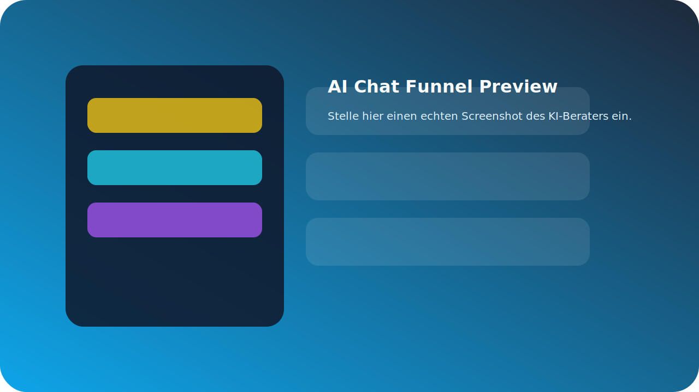
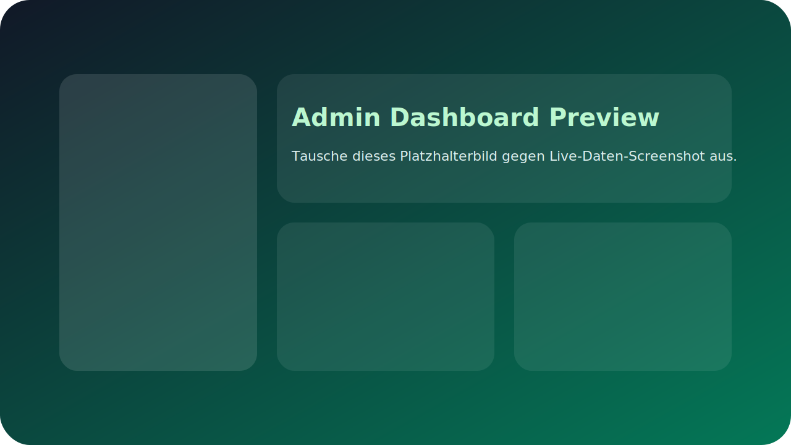
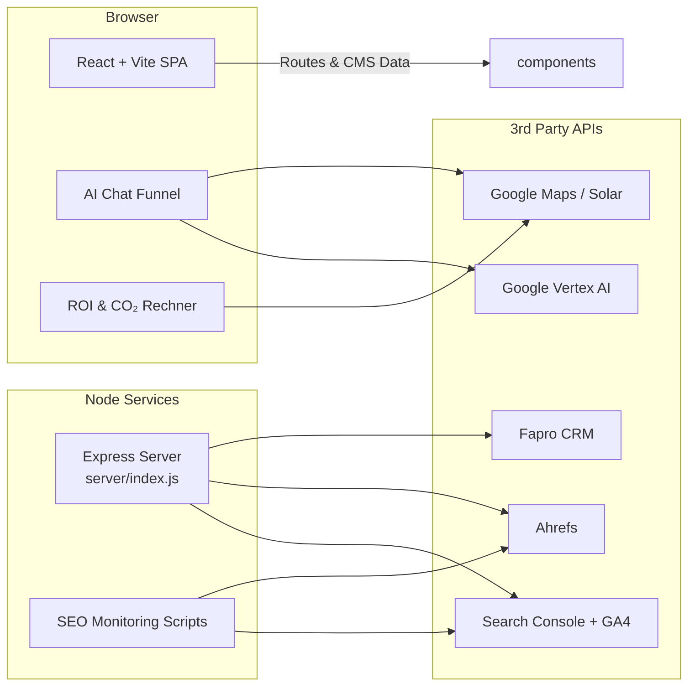

<div align="center">
  
  <h1>ZOE Solar Web Experience</h1>
  <p>State-of-the-art Kundenerlebnis für Photovoltaik-Projekte – mit KI-gestützter Beratung, interaktiven Rechnern und einem optionalen Admin-Dashboard.</p>
  <p><strong>Primärer Fokus:</strong> Premium-Webseite für neue & bestehende Kund:innen · <em>Kunden-/Mitarbeiterportal ist ein ergänzendes Modul</em></p>
  <p>
    <a href="#quickstart">Quickstart</a> ·
    <a href="#feature-highlights">Features</a> ·
    <a href="#architektur--systemlandschaft">Architektur</a>
  </p>
</div>

---

> [!IMPORTANT]
> Diese Codebasis liefert in erster Linie die öffentliche ZOE-Solar-Webseite (Landing Pages, Service-Navigation, KI-Chatfunnels). Das optionale Kunden-/Mitarbeiterportal wird als ergänzendes Modul ausgeliefert und kann separat aktiviert werden.

## Inhaltsverzeichnis

- [Überblick](#überblick)
- [Feature Highlights](#feature-highlights)
- [Screenshots & Visuals](#screenshots--visuals)
- [Tech Stack](#tech-stack)
- [Quickstart](#quickstart)
- [Environment & Secrets](#environment--secrets)
- [Projektstruktur (Auszug)](#projektstruktur-auszug)
- [Architektur & Systemlandschaft](#architektur--systemlandschaft)
- [UX- & Funnel-Bausteine](#ux--funnel-bausteine)
- [AI & Automations](#ai--automations)
- [Admin-Dashboard & Backoffice](#admin-dashboard--backoffice)
- [Backend API Endpoints (Specs)](#backend-api-endpoints-specs)
- [Cloud- & Drittanbieter-Konfiguration](#cloud--drittanbieter-konfiguration)
- [SEO & Rich-Result Checks](#seo--rich-result-checks)
- [Deployment Checklist](#deployment-checklist)
- [Roadmap & Ideen](#roadmap--ideen)
- [Ressourcen & Dokumentation](#ressourcen--dokumentation)
- [Lizenz & Credits](#lizenz--credits)

## Überblick

ZOE Solar adressiert B2B-Kund:innen mit großen Dach- und Freiflächen. Die Webseite führt Besucher:innen durch eine konvertierende Customer Journey – von Awareness (Storytelling, Use Cases, Vorteile) über Bewertung (Preisrechner, Produktvergleiche) bis zur Angebotsanfrage.

### Positionierung

- **Web-Plattform:** Premium-Markenerlebnis, SEO-optimiert, Conversion-getrieben.
- **Optionales Portal:** „Mitarbeiter-Login“ liefert Demo-Dashboards und KPI-Insights, wird jedoch bewusst aus dem Suchindex gehalten (`noindex`).
- **KI-Assistenz:** Mehrere Komponenten (Chat, Empfehlung, Konfigurator) helfen beim Qualifizieren von Leads und personalisieren Content on the fly.

## Feature Highlights

### 🚀 Customer Journey & Vertrauen

- Emotionale Story-Hero-Section (`components/Hero.tsx`, `PageHero.tsx`).
- Branchen-spezifische Service-Sektionen (`components/UseCaseNavigation.tsx`, `PhotovoltaikMegaMenu.tsx`).
- Sozialer Beweis via Testimonials, Fallstudien & Projektgalerie (`components/Testimonials.tsx`, `ProjectGallery.tsx`).

### 🧮 Interaktive Werkzeuge

- Sofort-Angebotsgefühl durch Stromspar- und ROI-Rechner (`components/Calculator.tsx`, `CO2Calculator.tsx`).
- Vergleichsmodale für Produkte & Tarife (`components/ComparisonModal.tsx`, `ComparisonTray.tsx`).
- Zero-Down-Payment & Finanzierungserklärer (`components/ZeroDownPayment.tsx`).

### 🧠 KI-gestützte Beratung

- Mehrstufiger KI-Chat-Funnel (`components/AIChatFunnel.tsx`, `components/AIRecommender.tsx`).
- Dynamische FAQs & Glossar mit Suche und semantischer Navigation.
- Generativer Content-Scoring-Workflow (Scripts unter `scripts/` & `server/`).

### 📊 Optionale Admin- & Monitoring-Module

- Mitarbeiter-Login (`/mitarbeiter-login`) mit KPI-Überblick, Taskboard & API-Key-Management.
- SEO-Monitoring & Alerts (Node-Skripte, siehe `package.json` → `seo-monitor`, `seo-alerts`).
- Google-, Ahrefs- und Review-Integrationen über den Express-Server (`server/`).

## Screenshots & Visuals

<div align="center">

| Landing Page Experience | AI Chat Funnel | Admin Dashboard |
| --- | --- | --- |
|  |  |  |

</div>

> [!TIP]
> Ersetze die SVG-Platzhalter unter `docs/screenshots/` durch echte Screenshots (z. B. via `npm run dev` + Browser-DevTools). Dateinamen beibehalten, damit die Vorschau im README automatisch aktualisiert wird.

## Tech Stack

<div align="center">

| Frontend | Styling | Backend & Automations | KI & Daten |
| --- | --- | --- | --- |
|  |  |  ·  |  |

</div>

Erweitert wird der Stack durch `react-router-dom`, `react-helmet-async`, `@google/genai`, `googleapis`, `axios`, `jsonwebtoken` u. v. m.

## Quickstart

1. **Repository klonen & Abhängigkeiten installieren**
   ```bash
   npm install
   ```
2. **Entwicklungsserver (Frontend) starten**
   ```bash
   npm run dev
   ```
   Der Vite-Dev-Server läuft standardmäßig unter `http://localhost:5173`.
3. **Optional: Admin/API-Server starten** – notwendig für SEO-Monitoring & API-Key-Verwaltung
   ```bash
   npm run server
   ```
   Der Express-Server lauscht auf Port `5001` (konfigurierbar via `PORT`).
  4. **Optional: Firecrawl-Productsync manuell auslösen** – aktualisiert `server/storage/products.live.json`
    ```bash
    npm run product-sync
    ```
    Nutzt Firecrawl MCP (lokal oder Remote), um alle Hersteller-Stammdaten und Produktfeeds zu aktualisieren.
  5. **Production-Build erzeugen**
   ```bash
   npm run build
   ```
  6. **Static Preview testen**
   ```bash
   npm run preview
   ```

## Scheduled Product-Sync (automatisch, unabhängig von Vercel)

- Die GitHub Actions Workflow-Datei `.github/workflows/product-sync.yml` ist so konfiguriert, dass sie täglich per `schedule`-Trigger ausgeführt wird (Default: `15 3 * * *` UTC → 03:15 UTC). 
- Wichtiger Punkt: Der Workflow läuft in GitHub-Runnern (Cloud) — dein Rechner oder Vercel müssen nicht laufen. Du hast die Secrets bereits in GitHub gesetzt, also wird der Job automatisch zur geplanten Zeit starten.
- Falls du nach dem Sync ein Cache-Invalidation/Revalidation auf Vercel möchtest, kann der Workflow optional nach dem Sync einen Deploy-/Webhook-Call an Vercel ausführen.
- **Failover mit Gemini:** Wenn Firecrawl keine Daten liefert (z. B. wegen 401/403 oder Timeouts) und `SERVER_GEMINI_API_KEY` gesetzt ist, springt automatisch ein Gemini-Fallback ein, um strukturierte Produktdaten aus dem Seiten-HTML zu extrahieren.

Siehe `docs/SETUP-GITHUB-SECRETS.md` für genaue Schritte zum Setzen der Secrets und zur manuellen Ausführung/Verifikation.


> [!TIP]
> Für Deployments empfiehlt sich ein zweistufiger Ansatz: (1) Static Hosting der Vite-Builds (z. B. Vercel, Netlify) und (2) separater Node-Service für Monitoring & Automations.

## Environment & Secrets

Leg die Variablen in `.env` oder `.env.local` (Vite) sowie serverseitig ab. Alle Variablen sind optional, viele Komponenten laufen mit Mock-Daten – für produktive Szenarien jedoch Pflicht.

| Variable | Scope | Zweck |
| --- | --- | --- |
| `VITE_GEMINI_API_KEY` / `SERVER_GEMINI_API_KEY` | Frontend · Server | KI-Chat & Recommendation Engine sowie KI-Fallback im Produkt-Sync (Google Vertex AI). |
| `VITE_GEMINI_MODEL` / `SERVER_GEMINI_MODEL` | Frontend · Server | Optionales Modell-Override für Chat & Produkt-Sync-Fallback (z. B. `gemini-1.5-pro`). |
| `VITE_GOOGLE_MAPS_STATIC_API_KEY`, `VITE_GOOGLE_GEOCODING_API_KEY`, `VITE_GOOGLE_PLACES_API_KEY`, `VITE_SOLAR_API_KEY` | Frontend | Karten, Geokodierung, Solar Roof Insights. |
| `SERVER_GOOGLE_SERVICE_ACCOUNT_JSON` | Server | Zugriff auf Search Console & GA4 (alternativ: `SERVER_GOOGLE_SERVICE_ACCOUNT_*`). |
| `SERVER_AHREFS_API_TOKEN`, `SERVER_AHREFS_TARGET` | Server | Backlink-Statistiken fürs Dashboard. |
| `SERVER_GMB_API_KEY`, `SERVER_GMB_ACCOUNT_NAME`, `SERVER_GMB_LOCATION_ID` | Server | Google Business Profile Monitoring. |
| `FIRECRAWL_MCP_ENDPOINT` / `FIRECRAWL_ENDPOINT` | Server | Basis-URL der Firecrawl MCP-Instanz (Default: `http://localhost:3000/v1/scrape`). |
| `FIRECRAWL_MCP_API_KEY` / `FIRECRAWL_API_KEY` | Server | Optionaler API-Key für Firecrawl MCP (bei Self-Hosting oft nicht nötig). |
| `FIRECRAWL_TIMEOUT_MS` | Server | Timeout für Firecrawl-Requests (Default: `45000`). |
| `DISABLE_PRODUCT_SYNC_CRON` | Server | Auf `true` setzen, um den täglichen Firecrawl-Sync zu deaktivieren. |
| `PRODUCTS_SYNC_CRON_SCHEDULE` | Server | Cron-Expression für den Sync (Default: `15 3 * * *` → alle 24h). |
| `PRODUCT_SYNC_MAX_MANUFACTURERS` | Server | Optionales Hard-Limit (z. B. `50`) für den Sync – überschreibt alle anderen Limits. |
| `PRODUCT_SYNC_DEV_LIMIT` | Server | Limit für Entwicklungs-Setups (Default: `2`, greift nur wenn `NODE_ENV` ≠ `production`). |
| `PRODUCT_SYNC_CONCURRENCY` | Server | Maximale gleichzeitige Firecrawl-Requests (Default: `3`). |
| `PRODUCTS_SYNC_KEY` | Server | Optionaler API-Key, um `/api/admin/products/sync` abzusichern. |
| `VITE_FAPRO_BASE_URL`, `VITE_FAPRO_API_KEY` | Frontend | Lead-Routing zum Fapro CRM. |

Weitere Details findest du in `docs/` (SEO-Playbooks, Content-Briefings, Workflows).

## Projektstruktur (Auszug)

```text
├─ components/              # Reusable Frontend-Module (Hero, Funnels, Dashboards, Navigation)
├─ data/                    # Content-Slices, Mock-Daten, SEO-Strategien
├─ server/                  # Express-API für Monitoring & API-Key-Verwaltung
├─ scripts/                 # Automations & SEO-Workflows (Node.js)
├─ pages/                   # Vite/React-Routes für statische Seiten
├─ public/                  # Static Assets (robots.txt, sitemap)
└─ docs/                    # Tiefergehende Konzepte, Strategien & Betriebshandbücher
```

## Architektur & Systemlandschaft



## UX- & Funnel-Bausteine

- **Lead Capture:** `ContactForm`, `OfferPopup`, `OfferCard` bündeln CTAs & Formulare.
- **Navigation & Content Hubs:** Mehrere Mega-Menüs (`PhotovoltaikMegaMenu`, `PreiseMegaMenu`, `WissenMegaMenu`) sorgen für schnelle Orientierung.
- **Storytelling-Reihen:** `PromoSection`, `PainPoints`, `Solutions`, `Process` leiten durch Problem → Lösung → Proof.
- **Media & Vertrauen:** `PromoVideo`, `VideoSection`, `Testimonials`, `ProjectGallery`.

## AI & Automations

- **Chat & Recommender:** `components/AIChatFunnel.tsx`, `components/AIRecommender.tsx` orchestrieren dialogbasierte Beratung.
- **Firecrawl MCP Product Discovery:** `server/services/productSync.js` + `npm run product-sync` crawlen Herstellerseiten (kostenlos via MCP) und aktualisieren den Produktkatalog täglich automatisch.
- **Monitoring & Alerts:** Skripte unter `scripts/seo-monitoring.cjs`, `scripts/seo-alerts.cjs`, `scripts/enhanced-seo-monitoring.cjs`.
- **API-Key-Orchestration:** `server/lib/apiKeyStore.js` + REST-Endpoints (`/api/admin/api-keys`).
- **Dashboards & KPI-Visualisierung:** `components/Dashboard/` + Daten aus `data/adminDashboard.ts`.

## Admin-Dashboard & Backoffice

> [!IMPORTANT]
> Das Mitarbeiter-Portal ist optional, aber für Auditor:innen und SEO-Teams hilfreich. Es bleibt aus SEO-Sicht `noindex`, kann jedoch produktiv geschaltet werden, sobald Authentifizierung und Datenquellen angebunden sind.

### Zugang & Sichtbarkeit

- **URL:** `/mitarbeiter-login` (Footer → „Mitarbeiter-Login“)
- **Demo-Zugänge:** `admin@zoe-solar.de` · `seo@zoe-solar.de` · Passwort `ZOEsolar2025!`
- **Auth-Status:** rein clientseitig, für Demos. Vor Go-Live durch Backend-Auth/SSO ersetzen.
- **Indexierung:** via `noindex` geschützt, zusätzlich Basic Auth empfohlen.

### KI-gestütztes Aufgabenboard

- Aufgabenquellen: Local SEO, Backlinks, Reviews (`data/adminDashboard.ts`).
- Workflows: `Offen → KI prüft … → Abgeschlossen`, inkl. Reset.
- Nachweis-Anforderung: Upload von Links/Notizen vor Abschluss.
- Erweiterung: Button „KI-Verifizierung“ kann mit echtem Review-Service verknüpft werden.

### Operative Nacharbeiten vor Launch

1. **Zugangsdaten härten:** Demo-Zugänge entfernen, produktive Identitäten & MFA erzwingen.
2. **Echte Datenquellen anbinden:** Search Console, GA4, Ahrefs, Google Business Profile, CRM.
3. **Monitoring automatisieren:** Cronjobs/Webhooks für KPI-Updates einrichten (siehe `docs/seo-geo-aeo-strategy.md`).
4. **Task-Sync:** Aufgabenboard mit Jira/Asana synchronisieren oder Datenquelle pflegen.
5. **Security:** Rate-Limits, Logging & Secrets-Management am Express-Server aktivieren.

## Backend API Endpoints (Specs)

| Endpoint | Methode | Beschreibung |
| --- | --- | --- |
| `/api/auth/login` | POST | Kund:innen anmelden. Setzt HTTP-only Session-Cookie. |
| `/api/auth/logout` | POST | Session invalidieren. |
| `/api/customer/profile` | GET/PUT | Profil abrufen bzw. aktualisieren. |
| `/api/customer/projects` | GET/POST | Projekte listen bzw. neue Anfragen anlegen. |
| `/api/customer/projects/{id}` | GET | Detailansicht inkl. Angebote, Rechnungen, Historie. |
| `/api/customer/projects/{projectId}/offers/{offerId}/accept` | POST | Angebot annehmen. |
| `/api/customer/invoices/{invoiceId}/pay` | POST | Zahlungsvorgang starten (z. B. Stripe). |
| `/api/products` | GET | Produktkatalog, filterbar via `?category=`. |
| `/api/products/live` | GET | Live-Daten aus dem Firecrawl-Sync (`server/storage/products.live.json`). |
| `/api/admin/products/sync` | POST | Firecrawl-MCP-Sync sofort auslösen (optional: Herstellerliste im Body). |

Siehe `server/` für Express-Routen und Mock-Daten. Session-Handling, Validierungen und externe Services müssen vor Produktivstart ergänzt werden.

## Cloud- & Drittanbieter-Konfiguration

### Google Cloud Platform

> Ersetze `[PROJECT_ID]` durch die echte Projekt-ID. Viele Komponenten laufen auch mit Mock-Daten, für KI & Karten ist eine Aktivierung jedoch Pflicht.

- **Vertex AI API (Gemini)** – Kern für Chat & Analysen · <https://console.cloud.google.com/apis/library/aiplatform.googleapis.com?project=[PROJECT_ID]>
- **Maps Static API** – Satellitenbilder für Dachanalysen · <https://console.cloud.google.com/apis/library/maps-static-backend.googleapis.com?project=[PROJECT_ID]>
- **Geocoding API** – Adressen → Koordinaten · <https://console.cloud.google.com/apis/library/geocoding-backend.googleapis.com?project=[PROJECT_ID]>
- **Solar API (empfohlen)** – Hochpräzise Potenzialdaten · <https://console.cloud.google.com/apis/library/solar.googleapis.com?project=[PROJECT_ID]>
- **Places API (optional)** – Adress-Autocomplete im Funnel · <https://console.cloud.google.com/apis/library/places-backend.googleapis.com?project=[PROJECT_ID]>

### Drittanbieter & Integrationen

- **Fapro CRM API** – Lead-Routing (`VITE_FAPRO_BASE_URL`, `VITE_FAPRO_API_KEY`). Default: `${window.location.origin}/api/fapro`.
- **Ahrefs API** – Backlink-Metriken (`SERVER_AHREFS_API_TOKEN`, `SERVER_AHREFS_TARGET`).
- **Google Business Profile API** – Review-Sync (`SERVER_GMB_API_KEY`, `SERVER_GMB_LOCATION_ID`).

## SEO & Rich-Result Checks

1. **Rich Results Test (Google):** `https://search.google.com/test/rich-results` → Seiten wie `/service/photovoltaik` testen.
2. **Search Console – Verbesserungen:** URL-Prüfung nach Deployments, auf strukturierte Daten achten.
3. **Search Console – Leistung:** Reports nach Ergebnisarten (FAQ, How-to, klassische Suche) filtern.
4. **Voice Search (optional):** Google Assistant/Voice Search auf Speakable-Markup prüfen.

## Deployment Checklist

1. **SEO & Legal:** Meta-Daten (`components/SEOManager.tsx`), Impressum/Datenschutz prüfen, hreflang falls Multi-Language geplant.
2. **Performance:** `npm run build` + Lighthouse Check (Core Web Vitals, LCP & CLS optimieren).
3. **Security:** Demo-Logins entfernen, echte Auth vorsehen, Rate-Limits im Express-Server aktivieren.
4. **Integrationen:** Search Console & Analytics Property verknüpfen, Ahrefs Token hinterlegen, CRM-Endpunkte testen.
5. **Monitoring:** Cronjobs für `seo-monitor` & `seo-alerts` aufsetzen (z. B. GitHub Actions oder Cloud Scheduler).

> [!NOTE]
> Das Mitarbeiter-Portal bleibt bewusst `noindex`. Stelle sicher, dass Deployments die robots-Metadaten respektieren und ggf. Basic-Auth oder Single-Sign-On ergänzen.

## Roadmap & Ideen

- Multilingualität (de/en) inkl. dynamischem Language Switch.
- Deep-Dives für Branchen (Logistik, Landwirtschaft, Handel) als eigenständige Landingpages.
- Live-Daten-Integrationen für Produktions- & Einspeise-Tracking.
- Automatisierte Angebots-PDFs direkt aus dem Chat-Funnel.

## Ressourcen & Dokumentation

- `docs/wiki/` – Projekt-Wiki (Home, Architektur, SEO-Automation, Operations, Content Playbook). Sync per `npm run wiki-sync` (optional `--dry-run`).
- `docs/seo-geo-aeo-strategy.md` – Strategische Roadmap für Local SEO & AI Overviews.
- `docs/content/` – Redaktionspläne, Tonalität, Storyline.
- `docs/automation/` – Setups für Monitoring, Alerts & CRM-Sync.
- `data/` – Mock-Daten & Inhaltsbausteine (leicht gegen echte APIs austauschbar).

## Lizenz & Credits

© 2025 ZOE Solar / DeepthinkAI2025. Alle Rechte vorbehalten. Interne Nutzung, Weitergabe nur nach Freigabe.

---

<div align="center">
  Mit ❤️ konzipiert für Solar-Pioniere, die Kundenerlebnisse lieben.
</div>