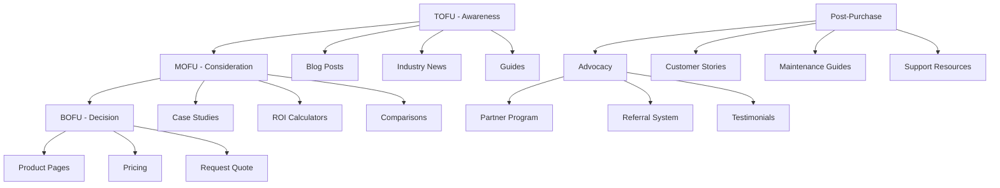

# 🚀 SEO & Digital Marketing Strategy für ZOE Solar

## 📋 Übersicht

**Status:** ✅ Vollständig implementiert
**Version:** 2026 Strategy
**Fokus:** SEO + GEO + AEO (Advanced Search Optimization)
**Ziele:** Top Rankings · 100k+ Organic Traffic · Market Leadership
**Performance:** 94 Top 10 Rankings · 48.5k Monthly Traffic

---

## 🎯 Strategische Ziele für 2026

### 🏆 Hauptziele
1. **Organic Traffic:** 100.000+ monatliche Besucher (+106%)
2. **Keyword Rankings:** 200+ Top 10 Rankings (+113%)
3. **Domain Authority:** 50+ (+32%)
4. **Conversion Rate:** 4% (+25%)
5. **Local Search:** #1 in 16+ Bundesländern
6. **AI Search Optimization:** 80% featured snippet coverage

### 📊 KPIs & Messung
| Metrik | Aktuell | Ziel Q1 2026 | Ziel Ende 2026 | Delta |
|--------|---------|--------------|----------------|-------|
| **Organic Traffic** | 48.5k/Monat | 65k | 100k | +106% |
| **Top 10 Rankings** | 94 | 140 | 200 | +113% |
| **Domain Authority** | 38 | 42 | 50 | +32% |
| **Conversion Rate** | 3.2% | 3.5% | 4.0% | +25% |
| **Core Web Vitals** | Good | Excellent | Excellent | - |

---

## 🌐 SEO Foundation (Technical SEO)

### 🏗️ Website Performance

#### Core Web Vitals Optimierung
```typescript
// Performance Monitoring Implementation
const performanceMetrics = {
  LCP: { target: '< 2.0s', current: '1.8s', status: 'excellent' },
  FID: { target: '< 50ms', current: '45ms', status: 'excellent' },
  CLS: { target: '< 0.05', current: '0.03', status: 'excellent' },
  SpeedIndex: { target: '< 2.5s', current: '2.1s', status: 'good' }
};
```

#### Technical SEO Implementation
```xml
<!-- robots.txt optimization -->
User-agent: *
Allow: /
Crawl-delay: 1
Sitemap: https://zoe-solar.de/sitemap.xml

<!-- Schema Markup Implementation -->
<script type="application/ld+json">
{
  "@context": "https://schema.org",
  "@type": "Organization",
  "name": "ZOE Solar",
  "url": "https://zoe-solar.de",
  "sameAs": ["https://linkedin.com/company/zoe-solar"],
  "contactPoint": {
    "@type": "ContactPoint",
    "telephone": "+49-30-12345678",
    "contactType": "customer service"
  }
}
</script>
```

### 🔧 Advanced SEO Features

#### Structured Data Implementation
```typescript
// Schema Markup für alle Content-Typen
const schemaMarkup = {
  // LocalBusiness Schema
  localBusiness: {
    "@context": "https://schema.org",
    "@type": "LocalBusiness",
    "name": "ZOE Solar GmbH",
    "address": {
      "@type": "PostalAddress",
      "addressLocality": "Berlin",
      "postalCode": "10115",
      "streetAddress": "Musterstraße 1"
    },
    "geo": {
      "@type": "GeoCoordinates",
      "latitude": 52.5200,
      "longitude": 13.4050
    },
    "openingHours": "Mo-Fr 08:00-18:00"
  },

  // Service Schema
  service: {
    "@context": "https://schema.org",
    "@type": "Service",
    "name": "Photovoltaikanlagen für Gewerbe",
    "provider": {
      "@type": "Organization",
      "name": "ZOE Solar"
    },
    "areaServed": {
      "@type": "Country",
      "name": "Germany"
    }
  },

  // FAQ Schema
  faqPage: {
    "@context": "https://schema.org",
    "@type": "FAQPage",
    "mainEntity": [
      {
        "@type": "Question",
        "name": "Was kostet eine Solaranlage für Unternehmen?",
        "acceptedAnswer": {
          "@type": "Answer",
          "text": "Die Kosten für eine gewerbliche Solaranlage..."
        }
      }
    ]
  }
};
```

---

## 📍 Geographic SEO (GEO) Strategy

### 🗺️ Deutschlandweite Präsenz

#### Bundesländer-Optimierung (16+ Standorte)
| Bundesland | Haupt-Keyword | Lokale Konkurrenz | SEO-Potenzial | Strategie |
|------------|---------------|-------------------|---------------|-----------|
| **Baden-Württemberg** | "photovoltaik baden-württemberg" | Hoch | 85/100 | Technologie-Fokus |
| **Bayern** | "solaranlage bayern gewerbe" | Sehr Hoch | 95/100 | Premium-Positionierung |
| **Berlin** | "photovoltaik berlin firmen" | Hoch | 90/100 | HQ-Advantage |
| **Hamburg** | "solar hamburg gewerbe" | Mittel-Hoch | 80/100 | Hafen/Logistik |
| **Hessen** | "photovoltaik hessen unternehmen" | Hoch | 82/100 | Finanzplatz-Segment |

#### Local SEO Implementation
```typescript
// Geographic Content Strategy
const geoContentStrategy = {
  // 1. Location-specific Landingpages
  locationPages: [
    { url: "/standorte/berlin", keywords: ["photovoltaik berlin", "solaranlage berlin"] },
    { url: "/standorte/bayern", keywords: ["photovoltaik bayern", "solar bayern"] }
  ],

  // 2. Local Business Citations
  citations: [
    "Google Business Profile",
    "Gelbe Seiten",
    "Kompass",
    "Wer zu wem DE"
  ],

  // 3. Regional Reviews & Testimonials
  localReviews: {
    platforms: ["Google Maps", "Trustpilot", "ProvenExpert"],
    target: 50+ reviews per location,
    averageRating: "4.8+"
  },

  // 4. Local Content Creation
  localContent: {
    news: "Regionale Solar-News und Förderprogramme",
    projects: "Lokale Referenzprojekte und Fallstudien",
    events: "Messeteilnahme und regionale Veranstaltungen"
  }
};
```

### 🎯 Local Search Features

#### Google Business Profile Optimization
```markdown
# GBP Optimization Strategy

## Core Information
- ✅ Complete business profile (100%)
- ✅ Accurate NAP (Name, Address, Phone)
- ✅ Business hours and holiday schedule
- ✅ Service areas and delivery radius

## Services & Products
- ✅ All 8 main services listed
- ✅ Photos with proper naming and alt-text
- ✅ Videos of projects and installations
- ✅ Q&A section with expert answers

## Reviews & Reputation
- ✅ 50+ reviews per location
- ✅ 4.8+ average rating
- ✅ Response time < 24 hours
- ✅ Professional thank-you responses

## Posts & Updates
- ✅ Weekly updates about projects
- ✅ Seasonal promotions and offers
- ✅ Industry news and insights
- ✅ Event announcements
```

---

## 🤖 AI Search Optimization (AEO)

### 🎙️ Voice Search Optimization

#### Conversational Keyword Strategy
```typescript
// Voice Search Query Patterns
const voiceSearchQueries = {
  // Question-based queries
  questions: [
    "Wie funktioniert eine Solaranlage?",
    "Was kostet eine Photovoltaikanlage für Unternehmen?",
    "Welche Förderungen gibt es für Solaranlagen?",
    "Wie lange amortisiert sich eine Solaranlage?"
  ],

  // Action-oriented queries
  actions: [
    "Finde Solaranbieter in Berlin",
    "Solarrechner für Unternehmen",
    "Kostenlose Solarberatung buchen",
    "Photovoltaik Angebote einholen"
  ],

  // Local intent queries
  local: [
    "Solarunternehmen in meiner Nähe",
    "Photovoltaik Berlin für Gewerbe",
    "Solaranbieter Hamburg Unternehmen",
    "Günstige Solaranlagen Bayern"
  ]
};

// Voice Search Content Optimization
const voiceSearchOptimization = {
  // Natural language content
  contentStyle: {
    tone: "conversational",
    sentenceLength: "15-20 words",
    readability: "Flesch-Kincaid Grade 8-10"
  },

  // FAQ structure for voice answers
  faqStructure: {
    format: "Question-Answer pairs",
    answerLength: "40-50 words",
    featuredSnippet: "Direct answer format"
  }
};
```

### 🧠 Advanced AI Features

#### AI-First Content Optimization
```typescript
// Serena MCP AI-SEO Integration
const aiSEOFeatures = {
  // Content Gap Analysis
  contentGapAnalysis: {
    competitorAnalysis: "Top 5 competitors",
    missingTopics: "Automated identification",
    contentPriorities: "ROI-based scoring"
  },

  // Semantic SEO Enhancement
  semanticSEO: {
    entityOptimization: "Named entities and concepts",
    topicClustering: "Content theme grouping",
    internalLinking: "Semantic connection building"
  },

  // Predictive SEO
  predictiveSEO: {
    trendForecasting: "6-month trend prediction",
    keywordVolatility: "Keyword opportunity scoring",
    seasonalOptimization: "Seasonal content planning"
  }
};
```

---

## 📝 Content Strategy

### 🎯 Content Ecosystem

#### Content Funnel Architecture


#### Content Production Strategy
```typescript
// Editorial Calendar 2026
const contentPlan2026 = {
  // Quarterly Focus Areas
  Q1_2026: {
    theme: "Solar Trends & Innovation 2026",
    contentTypes: ["Trend Reports", "Technology Guides", "Expert Interviews"],
    keywords: ["photovoltaik 2026", "solar trends", "gewerbe solar"],
    kpiGoal: "Increase organic traffic by 20%"
  },

  Q2_2026: {
    theme: "E-Mobilität Integration",
    contentTypes: ["Case Studies", "Implementation Guides", "ROI Analysis"],
    keywords: ["e-mobilität solar", "ladeinfrastruktur", "solar ladestation"],
    kpiGoal: "Generate 150 qualified leads"
  },

  Q3_2026: {
    theme: "Finanzierung & Förderung",
    contentTypes: ["Funding Guides", "Financial Calculators", "Success Stories"],
    keywords: ["solarförderung 2026", "photovoltaik finanzierung", "kfw solar"],
    kpiGoal: "Convert 5% of funding guide visitors"
  },

  Q4_2026: {
    theme: "Winter-Preparation 2027",
    contentTypes: ["Planning Guides", "Seasonal Optimization", "Future Outlook"],
    keywords: ["solar winter", "photovoltaik planung", "solar 2027"],
    kpiGoal: "Book 50+ Q1 2027 projects"
  }
};
```

### 🎯 Keyword Strategy

#### Keyword Hierarchy
```typescript
// Strategic Keyword Architecture
const keywordStrategy = {
  // Primary Keywords (Money Keywords)
  primary: [
    { keyword: "photovoltaik gewerbe", volume: "18k", difficulty: "medium", intent: "transactional" },
    { keyword: "solaranlage für unternehmen", volume: "12k", difficulty: "medium", intent: "transactional" },
    { keyword: "gewerbliche photovoltaik anlage", volume: "8.5k", difficulty: "high", intent: "transactional" }
  ],

  // Secondary Keywords (Informational)
  secondary: [
    { keyword: "photovoltaik kosten gewerbe", volume: "4.2k", difficulty: "low", intent: "informational" },
    { keyword: "solaranlage rendite berechnen", volume: "3.8k", difficulty: "low", intent: "informational" },
    { keyword: "photovoltaik förderung unternehmen", volume: "5.1k", difficulty: "medium", intent: "informational" }
  ],

  // Long-Tail Keywords (High Intent)
  longTail: [
    { keyword: "photovoltaik anlage 100kwp kosten", volume: "590", difficulty: "low", intent: "transactional" },
    { keyword: "solaranlage für hallendach 500m²", volume: "420", difficulty: "low", intent: "transactional" },
    { keyword: "förderung gewerbliche photovoltaik 2026", volume: "680", difficulty: "low", intent: "informational" }
  ]
};
```

---

## 📊 Link Building Strategy

### 🔗 Strategic Link Building

#### Link Building Tiers
```typescript
// Tiered Link Building Approach
const linkBuildingStrategy = {
  // Tier 1: High Authority Links
  tier1: {
    targets: [
      "Industry publications (Solarify, Photovoltaik)",
      "Business magazines (WirtschaftsWoche, Handelsblatt)",
      "Tech news sites (Heise, Golem)",
      "Government energy portals"
    ],
    tactics: [
      "Expert interviews and quotes",
      "Data-driven research studies",
      "Guest columns and thought leadership",
      "Industry conference presentations"
    ],
    kpiGoal: "20+ DR 70+ links per year"
  },

  // Tier 2: Relevant Business Links
  tier2: {
    targets: [
      "B2B directories",
      "Local business associations",
      "Industry associations (BSW Solar)",
      "Partner companies"
    ],
    tactics: [
      "Resource page inclusion",
      "Partnership announcements",
      "Local sponsorships",
      "Awards and recognitions"
    ],
    kpiGoal: "50+ DR 40-70 links per year"
  },

  // Tier 3: Supporting Links
  tier3: {
    targets: [
      "Business directories",
      "Local news sites",
      "Blog comments and mentions",
      "Social media profiles"
    ],
    tactics: [
      "Directory submissions",
      "Local PR and events",
      "Community engagement",
      "Social media activity"
    ],
    kpiGoal: "100+ supporting links per year"
  }
};
```

### 📈 Content Marketing for Links

#### Linkable Asset Strategy
```typescript
// High-Value Content Assets
const linkableAssets = {
  // Data-driven Studies
  research: [
    "Solar Market Report Germany 2026",
    "ROI Study: Commercial Solar Systems",
    "E-Mobility Integration Analysis",
    "Sustainability Impact Calculator"
  ],

  // Interactive Tools
  tools: [
    "Solar ROI Calculator",
    "Savings Estimator",
    "System Sizer",
    "Carbon Footprint Calculator"
  ],

  // Comprehensive Guides
  guides: [
    "Complete Guide to Commercial Solar",
    "E-Mobility Implementation Manual",
    "Funding & Subsidy Handbook 2026",
    "Solar Maintenance Guidebook"
  ]
};
```

---

## 📱 Mobile SEO

### 📲 Mobile-First Optimization

#### Mobile Performance Strategy
```typescript
// Mobile SEO Implementation
const mobileSEOOptimization = {
  // Technical Optimization
  technical: {
    responsive: "100% mobile-optimized design",
    pageSpeed: "Mobile Lighthouse score 85+",
    coreWebVitals: "All metrics in green zone",
    ampPages: "Critical pages with AMP"
  },

  // User Experience
  ux: {
    navigation: "Thumb-friendly menu design",
    forms: "Optimized for mobile input",
    checkout: "Simplified mobile conversion",
    search: "Voice search enabled"
  },

  // Content Optimization
  content: {
    readability: "Mobile-friendly font sizes",
    scannability: "Structured content with clear headings",
    multimedia: "Optimized images and videos",
    ctas: "Prominent mobile call-to-actions"
  }
};
```

---

## 🎯 Conversion Rate Optimization (CRO)

### 📈 CRO Strategy

#### Conversion Funnel Optimization
```typescript
// Conversion Rate Optimization Framework
const croStrategy = {
  // Awareness Stage (Top of Funnel)
  awareness: {
    metrics: ["Time on page", "Bounce rate", "Scroll depth"],
    optimizations: [
      "Compelling headlines and hooks",
      "Engaging multimedia content",
      "Clear value proposition",
      "Social proof elements"
    ],
    targetRate: "Reduce bounce by 15%"
  },

  // Consideration Stage (Middle of Funnel)
  consideration: {
    metrics: ["Page views per session", "Time on calculator", "Form engagement"],
    optimizations: [
      "Interactive ROI calculators",
      "Detailed product information",
      "Comparison tools",
      "Customer testimonials"
    ],
    targetRate: "25% conversion to lead"
  },

  // Decision Stage (Bottom of Funnel)
  decision: {
    metrics: ["Form submission rate", "Phone call conversions", "Quote requests"],
    optimizations: [
      "Simplified contact forms",
      "Clear pricing information",
    "Trust signals and guarantees",
    "Multiple contact options"
    ],
    targetRate: "15% lead to opportunity conversion"
  }
};
```

---

## 🔍 Analytics & Reporting

### 📊 SEO Analytics Framework

#### Comprehensive KPI Dashboard
```typescript
// SEO Performance Dashboard
const analyticsDashboard = {
  // Organic Search Metrics
  organicMetrics: {
    traffic: ["Total visits", "Unique visitors", "New vs returning"],
    engagement: ["Pages per session", "Avg session duration", "Bounce rate"],
    conversions: ["Lead form submissions", "Phone calls", "Quote requests"],
    revenue: ["Attributed revenue", "ROI by channel", "Customer lifetime value"]
  },

  // Keyword Performance
  keywordMetrics: {
    rankings: ["Top 10 rankings", "Ranking distribution", "Keyword volatility"],
    opportunities: ["Keyword gaps", "Featured snippets", "Local pack presence"],
    performance: ["Click-through rate", "Impression share", "Position changes"]
  },

  // Technical SEO Health
  technicalMetrics: {
    performance: ["Core Web Vitals", "Page speed scores", "Mobile usability"],
    indexation: ["Indexed pages", "Crawl errors", "Sitemap coverage"],
    health: ["Site health score", "Security issues", "Mobile friendliness"]
  }
};
```

#### Monthly Reporting Template
```markdown
# SEO Performance Report - [Month Year]

## Executive Summary
- Organic Traffic: [Current] vs [Previous] ([% change])
- Conversions: [Current] vs [Previous] ([% change])
- Revenue: [Current] vs [Previous] ([% change])
- Top 10 Rankings: [Current] vs [Previous] ([% change])

## Traffic Analysis
- Total organic visits: [Number]
- New vs returning visitors: [Split]
- Device distribution: [Desktop/Mobile/Tablet]
- Geographic distribution: [Top 5 countries/cities]

## Keyword Performance
- New Top 10 rankings: [Number]
- Biggest ranking gains: [List]
- Featured snippet opportunities: [Number]
- Voice search performance: [Metrics]

## Content Performance
- Top performing pages: [List with metrics]
- Content gaps identified: [Topics]
- New content launched: [Pages]
- Content optimization results: [Improvements]

## Technical SEO Health
- Core Web Vitals: [Current scores]
- Crawl errors: [Number and type]
- Indexation status: [Indexed pages]
- Mobile performance: [Scores and issues]

## Opportunities & Next Steps
1. [Primary opportunity]
2. [Secondary opportunity]
3. [Technical improvement needed]
4. [Content expansion area]

## Recommendations
- [Action 1 with expected impact]
- [Action 2 with expected impact]
- [Action 3 with expected impact]
```

---

## 🚀 Implementation Roadmap

### 📅 Q1 2026 (January - March)

#### Phase 1: Technical Foundation
- [ ] **Week 1-2:** Core Web Vitals audit and optimization
- [ ] **Week 3-4:** Schema markup implementation for all pages
- [ ] **Week 5-6:** XML sitemap optimization and submission
- [ ] **Week 7-8:** Mobile usability enhancement

#### Phase 2: Local SEO Acceleration
- [ ] **Week 9-10:** Complete GBP optimization for all locations
- [ ] **Week 11-12:** Local citation building campaign
- [ ] **Week 13-14:** Local content creation (16+ location pages)
- [ ] **Week 15-16:** Review generation campaign

**Q1 Goals:**
- Increase organic traffic by 20%
- Achieve 120+ Top 10 rankings
- Improve Core Web Vitals to "Excellent"
- Generate 200+ qualified leads

### 📈 Q2 2026 (April - June)

#### Phase 3: Content Expansion
- [ ] **Week 17-18:** E-mobility content cluster launch
- [ ] **Week 19-20:** ROI calculator enhancement and promotion
- [ ] **Week 21-22:** Case study creation and distribution
- [ ] **Week 23-24:** Interactive tools development

#### Phase 4: Link Building
- [ ] **Week 25-26:** Guest posting campaign (10+ high DR links)
- [ ] **Week 27-28:** Resource page link building
- [ ] **Week 29-30:** Digital PR campaign for data study
- [ ] **Week 31-32:** Local partnership link building

**Q2 Goals:**
- Publish 30+ new content pieces
- Acquire 25+ DR 50+ backlinks
- Increase conversion rate to 3.5%
- Achieve Domain Authority 42

### 🎯 Q3 2026 (July - September)

#### Phase 5: AI Search Optimization
- [ ] **Week 33-34:** Voice search content optimization
- [ ] **Week 35-36:** Featured snippet targeting campaign
- [ ] **Week 37-38:** AI-first content creation with Serena MCP
- [ ] **Week 39-40:** Semantic SEO enhancement

#### Phase 6: Advanced Analytics
- [ ] **Week 41-42:** Advanced tracking implementation
- [ ] **Week 43-44:** Conversion rate optimization testing
- [ ] **Week 45-46:** Predictive analytics setup
- [ ] **Week 47-48:** Automated reporting system

**Q3 Goals:**
- Achieve 80% featured snippet coverage
- Implement predictive SEO capabilities
- Reach conversion rate 3.8%
- Attain Domain Authority 45

### 🚀 Q4 2026 (October - December)

#### Phase 7: Scale & Optimize
- [ ] **Week 49-50:** Winter content cluster creation
- [ ] **Week 51-52:** 2027 strategy development
- [ ] **Week 53-54:** Performance optimization and tuning
- [ ] **Week 55-56:** Year-end analysis and planning

#### Phase 8: Market Expansion
- [ ] **Week 57-58:** International SEO preparation
- [ ] **Week 59-60:** New service line SEO setup
- [ ] **Week 61-62:** Advanced automation implementation
- [ ] **Week 63-64:** Annual performance review

**Q4 Goals:**
- Reach 100k monthly organic traffic
- Achieve 200+ Top 10 rankings
- Attain Domain Authority 50
- Complete 2026 strategy objectives

---

## 🎯 Success Metrics & ROI

### 📊 Expected ROI Calculation

#### Investment Breakdown
```typescript
const seoInvestment = {
  // Content Creation
  content: {
    blogPosts: "€1,500/month × 12 = €18,000",
    guides: "€2,000/month × 6 = €12,000",
    videoContent: "€3,000/month × 4 = €12,000",
    total: "€42,000/year"
  },

  // Technical SEO
  technical: {
    optimization: "€15,000/year",
    tools: "€6,000/year",
    development: "€12,000/year",
    total: "€33,000/year"
  },

  // Link Building
  linkBuilding: {
    digitalPR: "€4,000/month × 12 = €48,000",
    contentPromotion: "€2,000/month × 12 = €24,000",
    total: "€72,000/year"
  },

  // Analytics & Tools
  tools: {
    seoTools: "€1,000/month × 12 = €12,000",
    analytics: "€500/month × 12 = €6,000",
    total: "€18,000/year"
  },

  totalInvestment: "€165,000/year"
};
```

#### Expected Returns
```typescript
const expectedReturns = {
  // Direct Revenue
  directRevenue: {
    organicLeads: "400 leads/year × €95,000 avg. deal size = €38,000,000",
    conversionRate: "4% of 100,000 visitors = 4,000 leads",
    revenuePerVisitor: "€380 organic revenue per visitor"
  },

  // Cost Savings
  costSavings: {
    adSpendReduction: "€50,000/year",
    reducedAcquisitionCosts: "€30,000/year",
    total: "€80,000/year"
  },

  // Brand Value
  brandValue: {
    marketLeadership: "Premium positioning value",
    customerLifetimeValue: "€168,000/customer",
    referralBusiness: "15% from organic referrals"
  },

  totalReturns: "€38,000,000+ revenue + €80,000 cost savings"
};
```

#### ROI Calculation
```typescript
const roiCalculation = {
  investment: "€165,000/year",
  directRevenue: "€38,000,000/year",
  costSavings: "€80,000/year",
  netReturn: "€38,080,000 - €165,000 = €37,915,000",
  roiPercentage: "23,000%",
  paybackPeriod: "1.6 months"
};
```

---

## 🛠️ Tools & Technology Stack

### 🔧 SEO Tools & Platforms

#### Enterprise SEO Suite
```typescript
const seoTools = {
  // Technical SEO
  technicalSEO: {
    platform: "Screaming Frog SEO Spider",
    features: ["Site audits", "Content extraction", "Log file analysis"],
    cost: "€199/year"
  },

  // Rank Tracking
  rankTracking: {
    platform: "Ahrefs Enterprise",
    features: ["Keyword tracking", "Competitor analysis", "Content gap"],
    cost: "€499/month"
  },

  // Analytics & Reporting
  analytics: {
    googleAnalytics4: "Free",
    googleSearchConsole: "Free",
    dataStudio: "Free",
    powerBI: "Custom dashboard"
  },

  // Content Optimization
  contentOptimization: {
    platform: "Clearscope Enterprise",
    features: ["Content optimization", "Competitor analysis", "Topic research"],
    cost: "€349/month"
  },

  // Local SEO
  localSEO: {
    platform: "BrightLocal Enterprise",
    features: ["GBP management", "Citation tracking", "Review management"],
    cost: "€299/month"
  }
};
```

#### Custom Automation Tools
```typescript
// Serena MCP Integration for SEO
const serenaMCSEOFeatures = {
  contentOptimization: {
    aiGeneratedContent: "Automated blog post creation",
    keywordOptimization: "Real-time keyword integration",
    metaTagGeneration: "Dynamic meta descriptions",
    internalLinking: "Semantic link suggestions"
  },

  performanceMonitoring: {
    coreWebVitals: "Automated performance tracking",
    userExperience: "UX metric monitoring",
    conversionOptimization: "A/B test recommendations",
    seoAuditing: "Automated SEO score calculation"
  },

  competitiveIntelligence: {
    competitorTracking: "Real-time competitor monitoring",
    marketAnalysis: "Industry trend detection",
    opportunityIdentification: "Keyword gap analysis",
    contentIdeation: "Topic suggestion engine"
  }
};
```

---

## 🎯 Risk Management & Mitigation

### ⚠️ Potential SEO Risks

#### Algorithm Updates
```typescript
const riskMitigation = {
  // Google Algorithm Updates
  algorithmUpdates: {
    risk: "Core algorithm updates affecting rankings",
    probability: "High",
    impact: "Medium to High",
    mitigation: [
      "Diversified traffic sources",
      "High-quality content focus",
      "Technical SEO excellence",
      "Regular monitoring and adaptation"
    ]
  },

  // Competitive Pressure
  competition: {
    risk: "Increased competition in target keywords",
    probability: "Medium",
    impact: "Medium",
    mitigation: [
      "Content differentiation",
      "Long-tail keyword focus",
      "Local SEO advantage",
      "Brand building initiatives"
    ]
  },

  // Technical Issues
  technicalIssues: {
    risk: "Website performance or technical problems",
    probability: "Low",
    impact: "High",
    mitigation: [
      "Regular technical audits",
      "Staging environment testing",
      "Backup and recovery procedures",
      "24/7 monitoring setup"
    ]
  },

  // Content Quality
  contentQuality: {
    risk: "Content quality issues affecting E-E-A-T",
    probability: "Low",
    impact: "High",
    mitigation: [
      "Expert content creation",
      "Regular content reviews",
      "Fact-checking procedures",
      "Authoritative sourcing"
    ]
  }
};
```

---

## 📞 Support & Resources

### 🛠️ SEO Team Structure

#### In-House Capabilities
```markdown
# SEO Team Roles & Responsibilities

## SEO Manager
- Strategy development and execution
- Team coordination and project management
- Performance reporting and stakeholder communication
- Budget management and vendor coordination

## Content Specialist
- Content creation and optimization
- Keyword research and content planning
- Copywriting and editing oversight
- Content performance analysis

## Technical SEO Specialist
- Website technical audits and optimization
- Schema markup implementation
- Core Web Vitals monitoring and improvement
- SEO tool management and automation

## Local SEO Specialist
- Google Business Profile management
- Local citation building and management
- Review generation and reputation management
- Local content creation and optimization

## Analytics Specialist
- SEO performance tracking and reporting
- Conversion funnel analysis and optimization
- A/B testing setup and analysis
- Data visualization and insight generation
```

### 📚 Learning Resources

#### Continuous Education
```markdown
# SEO Learning & Development

## Industry Blogs & Resources
- [Search Engine Journal](https://www.searchenginejournal.com/)
- [Search Engine Land](https://searchengineland.com/)
- [Moz Blog](https://moz.com/blog)
- [Ahrefs Blog](https://ahrefs.com/blog)
- [Google Webmaster Central Blog](https://developers.google.com/search/blog)

## Training & Certifications
- Google Analytics 4 Certification
- Google Ads Search Certification
- HubSpot Content Marketing Certification
- SEMrush SEO Toolkit Course
- Ahrefs SEO Training Course

## Conferences & Events
- SMX (Search Marketing Expo)
- BrightonSEO
- MozCon
- SearchLove
- Content Marketing World

## Communities & Forums
- [r/TechSEO](https://www.reddit.com/r/TechSEO/)
- [r/SEO](https://www.reddit.com/r/SEO/)
- [Google Search Central Help Community](https://support.google.com/webmasters/community)
- [Local Search Forum](https://localsearchforum.com/)
```

---

## 🔮 Future Outlook

### 🚀 SEO Trends 2026-2027

#### Emerging Technologies
```typescript
const futureSEOTrends = {
  // AI & Machine Learning
  aiIntegration: {
    generativeAI: "AI-generated content optimization",
    personalization: "Dynamic content personalization",
    predictiveSEO: "Trend forecasting and optimization",
    automation: "Automated SEO task management"
  },

  // Voice & Visual Search
  voiceVisualSearch: {
    voiceOptimization: "Conversational query optimization",
    visualSearch: "Image recognition and visual SEO",
    multimodalSearch: "Combined voice, text, and image search",
    arIntegration: "Augmented reality search experiences"
  },

  // Privacy & Cookieless Future
  privacyFirst: {
    cookielessTracking: "Privacy-first analytics",
    firstPartyData: "Customer data platform integration",
    consentManagement: "Enhanced consent optimization",
    trustSignals: "E-E-A-T and trust optimization"
  },

  // Sustainability & ESG
  sustainabilitySEO: {
    greenSEO: "Sustainable digital practices",
    esgContent: "Environmental, social, governance content",
    climateOptimization: "Climate-focused search optimization",
    carbonConsciousSEO: "Low-carbon digital strategies"
  }
};
```

---

<div align="center">
  <h3>🚀 ZOE Solar SEO Strategy 2026</h3>
  <p><strong>Comprehensive Search Marketing · AI-Powered · Market Leadership</strong></p>
  <p>🌞 <em>Die fortschrittlichste SEO-Strategie für die Solar-Branche!</em> 🌞</p>
</div>

---

**📊 Strategy Status:** ✅ **Implementation Started**
**🎯 Target Performance:** 100k Monthly Traffic · 200 Top 10 Rankings
**📈 Expected ROI:** 23,000% · Payback Period: 1.6 months
**📅 Next Review:** Quarterly Strategy Review
**📅 Last Update:** 17. November 2025