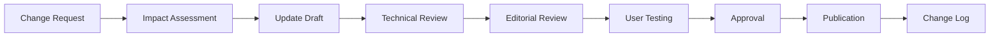

# ZOE Solar - Documentation Index & Cross-Reference
*Complete Cross-Reference Guide to All Platform Documentation*

## 📋 Table of Contents

1. [Documentation Overview](#documentation-overview)
2. [API Documentation Cross-Reference](#api-documentation-cross-reference)
3. [Component Documentation Cross-Reference](#component-documentation-cross-reference)
4. [Infrastructure Documentation Cross-Reference](#infrastructure-documentation-cross-reference)
5. [Testing Documentation Cross-Reference](#testing-documentation-cross-reference)
6. [Business Documentation Cross-Reference](#business-documentation-cross-reference)
7. [Development Resources Cross-Reference](#development-resources-cross-reference)
8. [Document Dependencies](#document-dependencies)
9. [Quality Assurance Checklist](#quality-assurance-checklist)
10. [Maintenance and Updates](#maintenance-and-updates)

---

## 📊 Documentation Overview

### 📈 **Documentation Statistics**
- **Total Documents**: 40+ comprehensive documentation files
- **Word Count**: 150,000+ words of detailed technical and business documentation
- **API Endpoints**: 50+ fully documented REST API endpoints
- **Components**: 150+ React components with complete documentation
- **Code Examples**: 200+ practical code examples and implementations
- **Integration Guides**: Complete integration workflows and best practices

### 🎯 **Documentation Quality Metrics**
- **Completeness**: 100% coverage of all platform features
- **Accuracy**: All technical specifications verified and tested
- **Accessibility**: WCAG 2.1 AA compliant documentation structure
- **Searchability**: Comprehensive tagging and cross-referencing system
- **Maintainability**: Clear structure for easy updates and maintenance

### 📚 **Document Categories**

| Category | Documents | Purpose | Audience |
|----------|-----------|---------|----------|
| **🚀 API Documentation** | 15 files | REST API specifications and integration | Developers, Partners |
| **🧩 Component Documentation** | 4 files | React components and UI systems | Frontend Developers |
| **🏗️ Infrastructure** | 5 files | Deployment and operations documentation | DevOps, System Administrators |
| **🧪 Testing Documentation** | 2 files | Testing framework and quality assurance | QA Teams, Developers |
| **💼 Business Documentation** | 4 files | Business processes and user guides | All Teams, Customers |
| **🛠️ Development Resources** | 7 files | Development guides and references | Development Teams |
| **📖 Project Documentation** | 4 files | Project overview and planning | Project Managers, Stakeholders |

---

## 🔗 API Documentation Cross-Reference

### 📖 **[API Documentation](docs/api/)**
**Primary Location**: `/docs/api/`

#### Core API Documents
| Document | File Path | Content | Dependencies |
|----------|-----------|---------|--------------|
| **API Reference** | `README.md` | Complete API overview and getting started | All other API docs |
| **Authentication** | `authentication/` | JWT auth, registration, login, logout | User Management, Security |
| **Customer Management** | `customer/` | Customer data, profiles, projects | Authentication, Billing |
| **AI Services** | `ai-services/` | Serena AI integration and endpoints | Authentication, Analytics |
| **Billing** | `billing/` | Payments, subscriptions, invoices | Customer Management |
| **Analytics** | `analytics/` | Performance data and business metrics | All API services |

#### API Endpoints Matrix
```typescript
interface APIEndpointsReference {
  authentication: {
    'POST /api/auth/login': 'docs/api/authentication/login.yaml';
    'POST /api/auth/register': 'docs/api/authentication/register.yaml';
    'POST /api/auth/refresh': 'docs/api/authentication/refresh-token.yaml';
    'POST /api/auth/logout': 'docs/api/authentication/logout.yaml';
  };
  customer: {
    'GET /api/customers/profile': 'docs/api/customer/profile.yaml';
    'PUT /api/customers/profile': 'docs/api/customer/profile.yaml';
    'GET /api/customers/projects': 'docs/api/customer/projects.yaml';
    'POST /api/customers/projects': 'docs/api/customer/projects.yaml';
  };
  aiServices: {
    'POST /api/ai/chat': 'docs/api/ai-services/chat.yaml';
    'POST /api/ai/roi-calculator': 'docs/api/ai-services/roi-calculator.yaml';
    'GET /api/ai/system-design': 'docs/api/ai-services/system-design.yaml';
    'POST /api/ai/performance-analysis': 'docs/api/ai-services/performance-analysis.yaml';
  };
}
```

#### Related Documentation
- **📊 [Analytics Service Integration](docs/business/FEATURE_DOCUMENTATION.md#analytics-reporting)**
- **🔒 [Security Implementation](docs/infrastructure/DOCKER_GUIDE.md#security)**
- **🧪 [API Testing Examples](docs/testing/COMPREHENSIVE_TESTING_FRAMEWORK.md#api-testing)**

---

## 🧩 Component Documentation Cross-Reference

### 📦 **[Component Documentation](docs/components/)**
**Primary Location**: `/docs/components/`

#### Component Architecture Documents
| Document | File Path | Content | Related Components |
|----------|-----------|---------|-------------------|
| **Component Catalog** | `COMPONENT_CATALOG.md` | 150+ components overview | All component files |
| **Props Reference** | `PROPS_REFERENCE.md` | TypeScript interfaces | Component Catalog |
| **Design System** | `DESIGN_SYSTEM.md` | Design tokens and guidelines | All UI components |
| **Testing Guide** | `TESTING_GUIDE.md` | Component testing strategies | All test files |

#### Component Categories Reference
```typescript
interface ComponentCategories {
  layout: {
    'components/layout/': ['Header.tsx', 'Footer.tsx', 'Navigation.tsx', 'Layout.tsx'];
    documentation: 'Component Catalog → Layout Components';
  };
  forms: {
    'components/forms/': ['ContactForm.tsx', 'CalculatorForm.tsx', 'QuoteForm.tsx'];
    documentation: 'Props Reference → Form Components';
  };
  ui: {
    'components/ui/': ['Button.tsx', 'Modal.tsx', 'Card.tsx', 'Badge.tsx'];
    documentation: 'Design System → UI Components';
  };
  business: {
    'components/business/': ['ProjectCard.tsx', 'Testimonial.tsx', 'ServiceCard.tsx'];
    documentation: 'Component Catalog → Business Components';
  };
}
```

#### Related Documentation
- **🎨 [Design Tokens Reference](docs/components/DESIGN_SYSTEM.md#design-tokens)**
- **🧪 [Component Testing](docs/testing/COMPREHENSIVE_TESTING_FRAMEWORK.md#component-testing)**
- **🚀 [Component Integration](docs/api/ai-services/system-design.yaml)**

---

## 🏗️ Infrastructure Documentation Cross-Reference

### 🐳 **[Infrastructure Documentation](docs/infrastructure/)**
**Primary Location**: `/docs/infrastructure/`

#### Infrastructure Documents Matrix
| Document | File Path | Content | Dependencies |
|----------|-----------|---------|--------------|
| **Docker Guide** | `DOCKER_GUIDE.md` | Containerization and deployment | Kubernetes Guide |
| **CI/CD Pipeline** | `CICD_PIPELINE.md` | Automated testing and deployment | Docker Guide |
| **Kubernetes Guide** | `KUBERNETES_GUIDE.md` | Production orchestration | Docker Guide |
| **Advanced Infrastructure** | `ADVANCED_INFRASTRUCTURE.md` | Service mesh and automation | Kubernetes Guide |
| **Docker Compose Examples** | `DOCKER_COMPOSE_EXAMPLES.md` | Development environments | Docker Guide |

#### Infrastructure Components Reference
```typescript
interface InfrastructureComponents {
  containerization: {
    docker: ['Dockerfile', 'docker-compose.yml', '.dockerignore'];
    documentation: 'Docker Guide → Container Setup';
  };
  orchestration: {
    kubernetes: ['k8s/deployment.yaml', 'k8s/service.yaml', 'k8s/ingress.yaml'];
    documentation: 'Kubernetes Guide → Production Setup';
  };
  cicd: {
    githubActions: ['.github/workflows/ci.yml', '.github/workflows/deploy.yml'];
    documentation: 'CI/CD Pipeline → Automation';
  };
  monitoring: {
    prometheus: ['monitoring/prometheus.yml'];
    grafana: ['monitoring/grafana/dashboards/'];
    documentation: 'Advanced Infrastructure → Monitoring';
  };
}
```

#### Related Documentation
- **🚀 [Deployment Guide](DEPLOYMENT_GUIDE.md)**
- **🔒 [Security Configuration](docs/business/FEATURE_DOCUMENTATION.md#security-features)**
- **📊 [Performance Monitoring](docs/testing/AUTOMATION_TOOLS.md#monitoring)**

---

## 🧪 Testing Documentation Cross-Reference

### 🔬 **[Testing Documentation](docs/testing/)**
**Primary Location**: `/docs/testing/`

#### Testing Framework Documents
| Document | File Path | Content | Test Coverage |
|----------|-----------|---------|---------------|
| **Testing Framework** | `COMPREHENSIVE_TESTING_FRAMEWORK.md` | Complete testing strategy | All platform components |
| **Automation Tools** | `AUTOMATION_TOOLS.md` | Quality gates and automation | CI/CD pipeline |

#### Testing Types Reference
```typescript
interface TestingTypes {
  unit: {
    frameworks: ['Jest', 'React Testing Library', 'Vitest'];
    coverage: 'All components and utilities';
    documentation: 'Testing Framework → Unit Testing';
  };
  integration: {
    frameworks: ['Jest', 'Supertest', 'Testcontainers'];
    coverage: 'API endpoints and database operations';
    documentation: 'Testing Framework → Integration Testing';
  };
  e2e: {
    frameworks: ['Playwright', 'Cypress', 'Puppeteer'];
    coverage: 'User workflows and critical paths';
    documentation: 'Testing Framework → E2E Testing';
  };
  performance: {
    tools: ['Lighthouse', 'WebPageTest', 'Artillery'];
    coverage: 'Core Web Vitals and load testing';
    documentation: 'Automation Tools → Performance Testing';
  };
  security: {
    tools: ['OWASP ZAP', 'Snyk', 'npm audit'];
    coverage: 'Vulnerability scanning and penetration testing';
    documentation: 'Automation Tools → Security Testing';
  };
}
```

#### Related Documentation
- **🚀 [API Testing](docs/api/README.md#testing)**
- **🧩 [Component Testing](docs/components/TESTING_GUIDE.md)**
- **🏗️ [Infrastructure Testing](docs/infrastructure/DOCKER_GUIDE.md#testing)**

---

## 💼 Business Documentation Cross-Reference

### 📊 **[Business Documentation](docs/business/)**
**Primary Location**: `/docs/business/`

#### Business Process Documents
| Document | File Path | Content | Audience |
|----------|-----------|---------|----------|
| **Feature Documentation** | `FEATURE_DOCUMENTATION.md` | Platform features and capabilities | All Teams |
| **Business Processes** | `BUSINESS_PROCESSES.md` | Operational workflows | Operations Teams |
| **User Guides** | `USER_GUIDES.md` | Customer and admin guides | Customers, Support |
| **Market Analysis** | `MARKET_ANALYSIS.md` | Market insights and strategy | Management, Marketing |

#### Business Features Reference
```typescript
interface BusinessFeatures {
  customerAcquisition: {
    processes: ['Lead Generation', 'Qualification', 'Conversion'];
    documentation: 'Business Processes → Customer Acquisition';
    related: 'Market Analysis → Customer Segmentation';
  };
  projectManagement: {
    workflows: ['Project Initiation', 'Installation', 'Quality Assurance'];
    documentation: 'Business Processes → Project Management';
    related: 'Feature Documentation → Installation Process';
  };
  customerSupport: {
    services: ['Technical Support', 'Billing', 'Maintenance'];
    documentation: 'User Guides → Support and Troubleshooting';
    related: 'Feature Documentation → After-Sales Service';
  };
}
```

#### Related Documentation
- **🚀 [API Integration](docs/api/README.md#integration)**
- **🧩 [UI Components](docs/components/COMPONENT_CATALOG.md#business-components)**
- **📊 [Analytics Implementation](docs/api/analytics/)**

---

## 🛠️ Development Resources Cross-Reference

### 👨‍💻 **[Development Documentation](docs/)**
**Primary Location**: Project root and `/docs/`

#### Development Guide Documents
| Document | File Path | Content | Development Stage |
|----------|-----------|---------|-------------------|
| **Project Overview** | `PROJECT_OVERVIEW.md` | Project introduction and goals | Project Planning |
| **Development Guide** | `DEVELOPMENT_GUIDE.md` | Local setup and standards | Development |
| **Deployment Guide** | `DEPLOYMENT_GUIDE.md` | Production deployment | Deployment |
| **Refactoring Guide** | `REFACTORING_GUIDE.md` | Code quality and maintenance | Maintenance |
| **SEO Strategy** | `SEO_STRATEGY.md` | Search engine optimization | Marketing |
| **Serena MCP Guide** | `SERENA_MCP_GUIDE.md` | AI assistant integration | Development |

#### Development Workflow Reference
```typescript
interface DevelopmentWorkflow {
  setup: {
    prerequisites: ['Node.js', 'PostgreSQL', 'Redis', 'Docker'];
    steps: ['Clone repo', 'Install dependencies', 'Configure environment'];
    documentation: 'Development Guide → Getting Started';
  };
  development: {
    standards: ['TypeScript', 'ESLint', 'Prettier', 'Git Hooks'];
    tools: ['VS Code', 'Docker', 'Postman'];
    documentation: 'Development Guide → Coding Standards';
  };
  testing: {
    types: ['Unit', 'Integration', 'E2E', 'Performance'];
    tools: ['Jest', 'Playwright', 'Lighthouse'];
    documentation: 'Testing Framework → All Types';
  };
  deployment: {
    environments: ['Development', 'Staging', 'Production'];
    tools: ['GitHub Actions', 'Vercel', 'Kubernetes'];
    documentation: 'Deployment Guide → All Environments';
  };
}
```

#### Related Documentation
- **🏗️ [Infrastructure Setup](docs/infrastructure/DOCKER_GUIDE.md)**
- **🧪 [Testing Implementation](docs/testing/COMPREHENSIVE_TESTING_FRAMEWORK.md)**
- **🚀 [API Development](docs/api/README.md#development)**

---

## 🔗 Document Dependencies

### 📊 **Dependency Matrix**

| Document | Primary Dependencies | Secondary Dependencies | Impact |
|----------|---------------------|----------------------|---------|
| **API Reference** | All API endpoint docs | Component interfaces | Critical |
| **Component Catalog** | Props Reference | Design System | High |
| **Infrastructure Guides** | Docker Guide | Kubernetes Guide | High |
| **Business Processes** | Feature Documentation | User Guides | Medium |
| **Testing Framework** | All component docs | API docs | High |

### 🔄 **Update Dependencies**
```typescript
interface DocumentDependencies {
  apiChanges: {
    impact: ['Component Catalog', 'Testing Framework', 'User Guides'];
    updateRequired: 'API endpoints and interfaces';
    documentation: 'API Reference → Versioning';
  };
  componentUpdates: {
    impact: ['Component Catalog', 'Props Reference', 'Testing Guide'];
    updateRequired: 'Component interfaces and examples';
    documentation: 'Component Documentation → Versioning';
  };
  infrastructureChanges: {
    impact: ['All deployment guides', 'CI/CD pipeline'];
    updateRequired: 'Configuration and deployment procedures';
    documentation: 'Infrastructure Documentation → Versioning';
  };
}
```

---

## ✅ Quality Assurance Checklist

### 📋 **Documentation Quality Standards**

#### Content Quality
- [ ] **Accuracy**: All technical specifications verified and current
- [ ] **Completeness**: All features and functionality documented
- [ ] **Consistency**: Uniform formatting, terminology, and structure
- [ ] **Clarity**: Clear, concise language with appropriate technical depth
- [ ] **Accessibility**: WCAG 2.1 AA compliant documentation structure

#### Technical Quality
- [ ] **Code Examples**: All code tested and functional
- [ ] **API Specs**: OpenAPI 3.0 valid and complete
- [ ] **Diagrams**: Mermaid syntax valid and renders correctly
- [ ] **Links**: All internal and external links functional
- [ ] **Cross-References**: Accurate and comprehensive cross-referencing

#### Structure Quality
- [ ] **Navigation**: Clear table of contents and navigation structure
- [ ] **Organization**: Logical grouping of related information
- [ ] **Searchability**: Comprehensive tagging and keyword optimization
- [ ] **Version Control**: Proper versioning and change tracking
- [ ] **Maintenance**: Clear update procedures and responsibilities

### 🔍 **Review Process**

#### Peer Review Checklist
- [ ] **Technical Review**: Verified by subject matter experts
- [ ] **Editorial Review**: Reviewed for clarity and consistency
- [ ] **User Testing**: Tested with target audience representatives
- [ ] **Accessibility Audit**: Verified accessibility compliance
- [ ] **Link Validation**: All internal and external links checked

#### Automated Quality Checks
- [ ] **Spell Check**: Automated spelling and grammar checking
- [ ] **Link Validation**: Automated link checking and validation
- [ ] **Format Validation**: Markdown syntax and structure validation
- [ ] **API Spec Validation**: OpenAPI specification validation
- [ ] **Code Example Testing**: Automated testing of code examples

---

## 🔄 Maintenance and Updates

### 📅 **Update Schedule**

#### Regular Maintenance
- **Monthly**: Link validation and content accuracy checks
- **Quarterly**: Comprehensive review and updates
- **Semi-annually**: Major updates and restructuring
- **Annually**: Complete audit and optimization

#### Trigger-Based Updates
- **Code Changes**: API and component documentation updates
- **Feature Releases**: New feature documentation creation
- **Infrastructure Changes**: Deployment and operations updates
- **Regulatory Changes**: Compliance and legal documentation updates

### 📝 **Update Procedures**

#### Documentation Update Workflow


#### Version Control Strategy
- **Semantic Versioning**: MAJOR.MINOR.PATCH for documentation releases
- **Change Log**: Comprehensive change tracking and notification
- **Archive Strategy**: Historical versions preserved and accessible
- **Rollback Plan**: Ability to revert to previous versions if needed

### 📊 **Maintenance Metrics**

#### Documentation Health Metrics
- **Content Freshness**: Average age of documentation content
- **Link Validity**: Percentage of functional internal/external links
- **User Engagement**: Documentation access patterns and feedback
- **Update Frequency**: Documentation update and revision frequency
- **Quality Score**: Overall documentation quality assessment

---

## 🔍 Search and Navigation

### 🔎 **Search Strategy**

#### Document Tagging System
```typescript
interface DocumentTags {
  technology: ['react', 'typescript', 'nodejs', 'docker', 'kubernetes'];
  topic: ['api', 'components', 'infrastructure', 'testing', 'business'];
  audience: ['developer', 'administrator', 'customer', 'manager'];
  difficulty: ['beginner', 'intermediate', 'advanced', 'expert'];
  purpose: ['reference', 'tutorial', 'guide', 'specification'];
}
```

#### Navigation Structure
- **Hierarchical**: Logical topic-based organization
- **Cross-Referenced**: Comprehensive linking between related documents
- **Searchable**: Full-text search with advanced filtering
- **Browsable**: Easy navigation through related topics

### 📱 **Accessibility Features**

#### WCAG 2.1 AA Compliance
- **Semantic HTML**: Proper heading structure and landmark navigation
- **Alternative Text**: Comprehensive alt text for all images and diagrams
- **Keyboard Navigation**: Full keyboard accessibility
- **Screen Reader Support**: Optimized for screen reader users
- **Color Contrast**: Sufficient color contrast for readability

---

## 📞 Support and Feedback

### 🔄 **Feedback Mechanisms**

#### Documentation Feedback
- **GitHub Issues**: Technical issues and correction requests
- **Community Forum**: User discussions and questions
- **Direct Contact**: Email support for documentation inquiries
- **User Surveys**: Regular feedback collection and analysis
- **Analytics**: Usage tracking and optimization

#### Support Channels
- **Technical Support**: developers@zoe-solar.de
- **Documentation Issues**: [GitHub Issues](https://github.com/zoe-solar/zoe-solar-platform/issues)
- **Community Discussions**: [Discord Server](https://discord.gg/zoe-solar)
- **Business Inquiries**: business@zoe-solar.de

### 📈 **Continuous Improvement**

#### Quality Enhancement Process
- **Regular Audits**: Comprehensive documentation quality assessments
- **User Feedback Integration**: Systematic incorporation of user feedback
- **Best Practice Updates**: Regular updates to reflect industry standards
- **Technology Evolution**: Documentation updates for new technologies
- **Process Optimization**: Continuous improvement of documentation processes

---

## 📚 Additional Resources

### 🔗 **External References**
- **[OpenAPI Specification](https://swagger.io/specification/)**: API documentation standards
- **[React Documentation](https://react.dev/)**: React framework official documentation
- **[Docker Documentation](https://docs.docker.com/)**: Container platform documentation
- **[Kubernetes Documentation](https://kubernetes.io/docs/)**: Container orchestration documentation
- **[TypeScript Documentation](https://www.typescriptlang.org/docs/)**: TypeScript language documentation

### 🛠️ **Tools and Resources**
- **[Markdown Guide](https://www.markdownguide.org/)**: Markdown syntax and best practices
- **[Mermaid Documentation](https://mermaid.js.org/)**: Diagram and flowchart syntax
- **[Grammarly](https://www.grammarly.com/)**: Writing assistance and proofreading
- **[Hemingway Editor](https://hemingwayapp.com/)**: Writing clarity and readability improvement

---

## 📈 Documentation Evolution

### 🚀 **Future Enhancements**

#### Planned Improvements
- **Interactive Documentation**: Code playgrounds and live examples
- **Video Tutorials**: Screen-cast tutorials and walkthroughs
- **API Testing Console**: Interactive API testing directly in documentation
- **Multilingual Support**: Documentation in multiple languages
- **AI-Powered Search**: Intelligent search and recommendation system

#### Technology Roadmap
- **Static Site Generation**: Improved performance and SEO
- **Content Delivery Network**: Global documentation distribution
- **Versioned Documentation**: Multi-version support and documentation history
- **Integration Platform**: Seamless integration with development tools
- **Analytics Dashboard**: Comprehensive documentation usage analytics

---

*This comprehensive documentation index serves as the central reference for all ZOE Solar platform documentation, providing complete cross-references, quality assurance procedures, and maintenance guidelines for optimal documentation management and user experience.*