# ZOE Solar - Business Processes Documentation
*Comprehensive Business Process Workflows and Standard Operating Procedures*

## 📋 Table of Contents

1. [Customer Acquisition Process](#customer-acquisition-process)
2. [Sales Process Workflow](#sales-process-workflow)
3. [Project Management Lifecycle](#project-management-lifecycle)
4. [Installation Process](#installation-process)
5. [Customer Onboarding](#customer-onboarding)
6. [After-Sales Service](#after-sales-service)
7. [Quality Assurance Process](#quality-assurance-process)
8. [Financial Management](#financial-management)
9. [Supply Chain Operations](#supply-chain-operations)
10. [Compliance and Legal](#compliance-and-legal)

---

## 🎯 Customer Acquisition Process

### 1. Lead Generation Strategy

**Objective**: Generate qualified leads through multiple channels with systematic nurturing.

**Process Flow**:

```mermaid
graph TD
    A[Marketing Campaigns] --> B[Lead Capture]
    B --> C[Lead Qualification]
    C --> D[Lead Scoring]
    D --> E{Score ≥ 70?}
    E -->|Yes| F[Sales Contact]
    E -->|No| G[Lead Nurturing]
    G --> C
    F --> H[Consultation Booking]
```


**Key Activities**:
- **Digital Marketing**: SEO, PPC, social media campaigns
- **Content Marketing**: Educational content, solar guides, case studies
- **Partnership Marketing**: Referral programs with real estate agents, builders
- **Event Marketing**: Trade shows, community events, webinars
- **Website Optimization**: Conversion rate optimization and A/B testing

**Success Metrics**:
- Cost per lead (CPL): < €85
- Lead to qualification rate: > 35%
- Marketing qualified lead (MQL) conversion: > 20%
- Return on ad spend (ROAS): > 400%

### 2. Lead Qualification Framework

**BANT Framework Implementation**:
- **Budget**: Does the prospect have sufficient budget? (€10,000+)
- **Authority**: Is the decision-maker involved in the conversation?
- **Need**: Is there a genuine need for solar energy?
- **Timeline**: Is the project timeline within 6 months?

**Qualification Criteria**:
```typescript
interface LeadQualification {
  geographic: {
    serviceableArea: boolean;
    solarFeasibility: 'high' | 'medium' | 'low';
    localIncentives: IncentiveEligibility[];
  };
  financial: {
    budgetRange: 'under_20k' | '20k_50k' | '50k_100k' | 'over_100k';
    creditScore: CreditRating;
    financingInterest: FinancingInterest[];
  };
  property: {
    ownershipStatus: 'owner' | 'renter' | 'planning_purchase';
    roofCondition: 'excellent' | 'good' | 'fair' | 'poor';
    shadingIssues: ShadingAssessment;
    electricalCapacity: GridCompatibility;
  };
  motivation: {
    primaryDriver: 'cost_savings' | 'environmental' | 'energy_independence' | 'property_value';
    urgency: TimelineUrgency;
    competitorAwareness: CompetitorConsideration[];
  };
}
```

### 3. Lead Nurturing Workflows

**Automated Email Sequences**:
- **Stage 1**: Welcome + Educational Content (Day 0, 3, 7)
- **Stage 2**: Solar Benefits + Case Studies (Day 10, 14, 18)
- **Stage 3**: Cost Analysis + ROI Calculator (Day 21, 25, 30)
- **Stage 4**: Personalized Consultation Invitation (Day 35)

**Multi-channel Nurturing**:
- **Email Marketing**: Personalized content based on user behavior
- **Retargeting Ads**: Dynamic ads based on website interactions
- **SMS Campaigns**: Appointment reminders and follow-ups
- **Direct Mail**: Personalized proposals for high-value leads

**Lead Scoring Algorithm**:
```typescript
interface LeadScoring {
  demographic: {
    locationScore: number; // 0-20 points
    propertyType: number; // 0-15 points
    incomeLevel: number; // 0-15 points
  };
  behavioral: {
    websiteVisits: number; // 0-25 points
    calculatorUsage: number; // 0-20 points
    contentEngagement: number; // 0-15 points
  };
  timing: {
    projectUrgency: number; // 0-10 points
    responseTime: number; // 0-5 points
  };
  totalScore: number; // Max 125 points
}
```

---

## 💼 Sales Process Workflow

### 1. Initial Contact and Needs Assessment

**Pre-Call Preparation**:
```typescript
interface SalesPreparation {
  leadResearch: {
    propertyAnalysis: SatelliteImagery[];
    solarFeasibility: TechnicalAssessment[];
    localRegulations: ComplianceCheck[];
    incentiveEligibility: FinancialIncentives[];
  };
  personalization: {
    customizedPresentation: TailoredContent[];
    relevantCaseStudies: SimilarProjects[];
    competitiveAnalysis: MarketPositioning[];
    pricingStrategy: PriceOptimization[];
  };
  tools: {
    crmIntegration: SalesforceHubspot[];
    presentationSoftware: PowerPointKeynote[];
    calculationTools: ROICalculator[];
    contractTemplates: LegalDocuments[];
  };
}
```

**Discovery Call Framework**:
1. **Introduction** (5 min): Company overview and call agenda
2. **Understanding Needs** (15 min): Current energy situation, goals, concerns
3. **Property Assessment** (10 min): Roof analysis, energy consumption patterns
4. **Solution Overview** (15 min): Proposed system approach and benefits
5. **Financial Discussion** (10 min): Budget, financing options, ROI expectations
6. **Next Steps** (5 min): Site assessment scheduling and follow-up actions

**Key Questions for Needs Assessment**:
- Current monthly electricity bill and consumption patterns
- Roof age, condition, and available space
- Future energy needs (electric vehicle, home expansion)
- Budget range and financing preferences
- Decision timeline and key stakeholders
- Specific concerns about solar installation

### 2. Technical Site Assessment

**On-Site Evaluation Process**:


**Technical Assessment Checklist**:
- **Structural Analysis**: Roof load capacity, mounting options, accessibility
- **Electrical Evaluation**: Panel capacity, wiring condition, main breaker size
- **Shading Assessment**: Tree shadows, nearby buildings, seasonal variations
- **Orientation Analysis**: Roof direction, tilt angle, optimal placement
- **Permit Requirements**: Local building codes, HOA approvals, utility requirements

**Assessment Tools**:
- **Drone Imaging**: High-resolution aerial photography and 3D modeling
- **Solar Pathfinder**: Shading analysis throughout the year
- **Infrared Camera**: Electrical system thermal inspection
- **Measurement Tools**: Laser distance meters, digital inclinometers
- **Load Analysis**: Energy consumption monitoring equipment

### 3. System Design and Proposal Generation

**Design Process**:
```typescript
interface SystemDesign {
  technicalDesign: {
    panelLayout: ArrayConfiguration[];
    inverterSpecification: PowerElectronics[];
    mountingSystem: StructuralDesign[];
    electricalSchematic: WiringDiagram[];
    batteryIntegration: EnergyStorage[];
  };
  performanceModeling: {
    energyProduction: ProductionForecast[];
    systemLosses: EfficiencyCalculation[];
    degradationModel: LongTermPerformance[];
    weatherAdjustment: ClimateData[];
  };
  financialAnalysis: {
    costBreakdown: DetailedPricing[];
    roiCalculation: FinancialMetrics[];
    financingOptions: PaymentStructures[];
    incentiveAnalysis: GovernmentBenefits[];
  };
}
```

**Proposal Components**:
- **Executive Summary**: Key benefits and investment highlights
- **Technical Specifications**: Detailed equipment and installation details
- **Financial Analysis**: Complete cost breakdown and ROI projections
- **Installation Timeline**: Project phases and completion dates
- **Warranty Information**: Equipment and workmanship coverage details
- **Company Profile**: Experience, certifications, and customer references

### 4. Closing and Contract Execution

**Closing Strategy**:
- **Value Reinforcement**: Emphasize long-term savings and environmental benefits
- **Risk Mitigation**: Address common concerns and objections proactively
- **Urgency Creation**: Limited-time incentives and financing rate guarantees
- **Social Proof**: Share relevant case studies and customer testimonials
- **Decision Facilitation**: Make the choice clear and easy to understand

**Contract Management Process**:
1. **Contract Presentation**: Detailed review of terms and conditions
2. **Question Resolution**: Address all customer concerns and clarifications
3. **Financial Approval**: Financing application and approval process
4. **Permit Application**: Submit all necessary permits and applications
5. **Final Signatures**: Execute contracts and complete initial payments

**Legal Compliance**:
- **Cooling-off Period**: 14-day right of cancellation (EU requirement)
- **Consumer Protection**: Full disclosure of terms and cancellation rights
- **Financing Compliance**: adherence to consumer credit regulations
- **Data Privacy**: GDPR compliance for personal information handling

---

## 🏗️ Project Management Lifecycle

### 1. Project Initiation Phase

**Project Setup Process**:
```typescript
interface ProjectInitiation {
  projectCreation: {
    customerProfile: CustomerData[];
    siteInformation: LocationDetails[];
    systemSpecifications: TechnicalRequirements[];
    contractDetails: AgreementTerms[];
  };
  resourceAllocation: {
    projectManager: TeamAssignment[];
    installationCrew: SkilledLabor[];
    equipmentScheduling: ResourceCalendar[];
    materialProcurement: SupplyChain[];
  };
  planningPhase: {
    detailedTimeline: ProjectSchedule[];
    riskAssessment: RiskMitigation[];
    qualityStandards: QualityCriteria[];
    communicationPlan: StakeholderUpdates[];
  };
}
```

**Project Documentation Package**:
- **Project Charter**: Scope, objectives, and success criteria
- **Resource Plan**: Team composition and allocation schedule
- **Risk Register**: Potential risks and mitigation strategies
- **Communication Matrix**: Stakeholder communication plan
- **Quality Management Plan**: Quality standards and inspection procedures

### 2. Detailed Planning Phase

**Work Breakdown Structure (WBS)**:
```typescript
interface WorkBreakdown {
  preInstallation: {
    permitAcquisition: PermitProcess[];
    materialProcurement: SupplyManagement[];
    crewScheduling: TeamCoordination[];
    sitePreparation: PreWorkRequirements[];
  };
  installationPhase: {
    mountingSystem: StructureAssembly[];
    panelInstallation: ArrayMounting[];
    electricalWork: WiringIntegration[];
    commissioning: SystemActivation[];
  };
  postInstallation: {
    inspectionApproval: FinalInspection[];
    customerTraining: UserEducation[];
    documentation: ProjectHandover[];
    warrantySetup: CoverageActivation[];
  };
}
```

**Critical Path Analysis**:
- **Permit Acquisition**: 5-15 business days (critical path item)
- **Material Delivery**: 2-4 weeks from order confirmation
- **Installation Work**: 1-3 days depending on system complexity
- **Utility Connection**: 1-2 weeks after installation completion
- **Final Inspection**: 1-3 days after utility connection

**Risk Management Framework**:
- **Technical Risks**: Equipment availability, installation challenges
- **Regulatory Risks**: Permit delays, inspection failures
- **Weather Risks**: Installation delays due to weather conditions
- **Supply Chain Risks**: Material shortages, delivery delays
- **Customer Risks**: Changes in requirements, payment issues

### 3. Execution and Monitoring Phase

**Project Tracking Dashboard**:
```typescript
interface ProjectMonitoring {
  scheduleTracking: {
    milestoneProgress: CompletionStatus[];
    criticalPathMonitoring: CriticalTaskStatus[];
    resourceUtilization: TeamPerformance[];
    budgetTracking: CostControl[];
  };
  qualityManagement: {
    inspectionResults: QualityCheckpoints[];
    photoDocumentation: ProgressEvidence[];
    complianceVerification: RegulatoryAdherence[];
    customerFeedback: SatisfactionMetrics[];
  };
  stakeholderCommunication: {
    progressReports: RegularUpdates[];
    issueResolution: ProblemManagement[];
    changeRequests: ModificationControl[];
    escalationProcedures: IssueEscalation[];
  };
}
```

**Communication Protocols**:
- **Daily Standups**: Project team coordination meetings
- **Weekly Progress Reports**: Customer updates on project status
- **Quality Check-ins**: Regular quality assurance reviews
- **Stakeholder Meetings**: Key milestone reviews and approvals
- **Issue Resolution**: Rapid response to problems and changes

### 4. Project Closure Phase

**Completion Checklist**:
- **Technical Completion**: All system components installed and tested
- **Utility Approval**: Grid connection approved and activated
- **Final Inspection**: All required inspections passed
- **Customer Acceptance**: Customer sign-off on project completion
- **Documentation**: All project documents delivered and archived
- **Financial Settlement**: Final payments processed and invoices issued

**Handover Package**:
- **System Manuals**: Equipment operation and maintenance guides
- **Warranty Documents**: Manufacturer and installation warranty details
- **Monitoring Setup**: System performance monitoring activation
- **Emergency Contacts**: Support contact information and procedures
- **Maintenance Schedule**: Recommended maintenance timeline
- **Performance Expectations**: System output and savings projections

---

## ⚡ Installation Process

### 1. Pre-Installation Preparation

**Site Preparation Requirements**:
```typescript
interface SitePreparation {
  propertyAccess: {
    clearWorkAreas: AccessVerification[];
    parkingArrangements: VehicleAccess[];
    protectionMeasures: PropertySafeguards[];
    utilityLocates: UndergroundUtilities[];
  };
  materialStaging: {
    deliveryCoordination: MaterialArrival[];
    storageArea: StagingLocation[];
    equipmentSetup: ToolPreparation[];
    safetyEquipment: PPERequirements[];
  };
  crewBriefing: {
    safetyReview: JobHazardAnalysis[];
    workPlanReview: InstallationStrategy[];
    roleAssignment: TeamCoordination[];
    emergencyProcedures: IncidentResponse[];
  };
}
```

**Safety Pre-Installation Check**:
- **Fall Protection**: Roof safety harnesses and anchor points
- **Electrical Safety**: Lockout/tagout procedures, voltage testers
- **Personal Protective Equipment**: Hard hats, safety glasses, gloves
- **Weather Assessment**: Safe working condition verification
- **Site Security**: Property protection and access control

### 2. Installation Execution

**Day-by-Day Installation Process**:

**Day 1: Preparation and Mounting**
- **Morning**: Site setup, safety briefing, material staging
- **Mid-day**: Rafter layout, mounting bracket installation
- **End of Day**: Weather protection, site cleanup, progress photos

**Day 2: Panel Installation and Electrical**
- **Morning**: Panel mounting and racking completion
- **Mid-day**: DC wiring, inverter installation
- **End of Day**: System testing, safety checks, documentation

**Day 3: Connection and Commissioning**
- **Morning**: AC wiring, utility connection coordination
- **Mid-day**: System startup, performance testing
- **End of Day**: Customer training, final inspection preparation

**Installation Quality Standards**:
```typescript
interface InstallationStandards {
  mountingSystem: {
    structuralIntegrity: LoadBearingCapacity[];
    weatherproofing: SealingProtection[];
    manufacturerSpecs: EquipmentGuidelines[];
    industryBestPractices: InstallationMethods[];
  };
  electricalWork: {
    codeCompliance: NECRequirements[];
    wiringMethods: ElectricalStandards[];
    groundingSystems: SafetyGrounding[];
    surgeProtection: EquipmentProtection[];
  };
  commissioning: {
    systemTesting: PerformanceVerification[];
    safetyChecks: OperationalSafety[];
    monitoringSetup: DataCollection[];
    calibration: SensorAccuracy[];
  };
}
```

### 3. Post-Installation Activities

**System Commissioning Process**:
1. **Visual Inspection**: Complete system visual check for quality
2. **Electrical Testing**: Voltage, current, and resistance measurements
3. **Performance Verification**: System output under load conditions
4. **Safety Testing**: Ground fault, arc fault, and emergency shutdown
5. **Monitoring Setup**: Performance monitoring system activation
6. **Customer Training**: System operation and maintenance education

**Documentation Requirements**:
- **Installation Photos**: Before, during, and after installation images
- **Test Results**: Electrical measurements and performance data
- **As-Built Drawings**: Final system layout and wiring diagrams
- **Warranty Registration**: Manufacturer warranty documentation
- **Maintenance Records**: Initial setup and future maintenance schedule

---

## 🏠 Customer Onboarding

### 1. Welcome and Introduction Process

**Customer Welcome Package**:
```typescript
interface WelcomePackage {
  digitalDelivery: {
    customerPortal: OnlineAccess[];
    mobileApp: SmartphoneAccess[];
    monitoringDashboard: PerformanceTracking[];
    documentLibrary: ResourceAccess[];
  };
  physicalMaterials: {
    systemManual: OperatingGuide[];
    warrantyCard: CoverageDetails[];
    emergencyContacts: SupportInformation[];
    maintenanceSchedule: ServiceTimeline[];
  };
  trainingServices: {
    inPersonDemonstration: OnsiteTraining[];
    videoTutorials: LearningResources[];
    webinars: EducationalSessions[];
    faqResources: SelfHelpMaterials[];
  };
}
```

**Onboarding Timeline**:
- **Day 1**: Welcome email and portal access instructions
- **Day 2**: Customer account setup and profile completion
- **Day 3**: System performance monitoring activation
- **Day 7**: Customer satisfaction survey and check-in call
- **Day 30**: 30-day performance review and optimization suggestions

### 2. Customer Education and Training

**Education Curriculum**:
```typescript
interface CustomerEducation {
  systemOperation: {
    basicFunctions: EverydayUse[];
    monitoringInterpretation: PerformanceUnderstanding[];
    alertResponses: IssueRecognition[];
    emergencyProcedures: SafetyProtocols[];
  };
  maintenanceKnowledge: {
    cleaningGuidelines: PanelMaintenance[];
    vegetationManagement: ShadingControl[];
    weatherConsiderations: SeasonalAdjustments[];
    performanceOptimization: SystemEfficiency[];
  };
  benefitsMaximization: {
    energyUsageOptimization: ConsumptionPatterns[];
    timeOfUseStrategies: RateOptimization[];
    batteryManagement: StorageUtilization[];
    environmentalImpact: SustainabilityTracking[];
  };
}
```

**Training Delivery Methods**:
- **In-Person Training**: On-site demonstration during commissioning
- **Video Library**: Comprehensive tutorial video collection
- **Live Webinars**: Regular educational sessions on advanced topics
- **Interactive Guides**: Step-by-step online instruction modules
- **Mobile App Support**: In-app guidance and help features

### 3. System Monitoring and Optimization

**Performance Monitoring Dashboard**:
```typescript
interface SystemMonitoring {
  realTimeData: {
    energyProduction: CurrentOutput[];
    householdConsumption: UsagePatterns[];
    gridInteraction: ImportExport[];
    batteryStatus: StorageLevels[];
  };
  historicalAnalysis: {
    productionTrends: PerformanceHistory[];
    efficiencyRatings: SystemEffectiveness[];
    weatherImpact: EnvironmentalFactors[];
    degradationTracking: LongTermPerformance[];
  };
  alertsNotifications: {
    performanceIssues: ProblemDetection[];
    maintenanceReminders: ServiceScheduling[];
    weatherAlerts: ConditionWarnings[];
    efficiencyTips: OptimizationSuggestions[];
  };
}
```

**Optimization Recommendations**:
- **Usage Pattern Analysis**: Recommendations for optimal energy consumption
- **Rate Plan Optimization**: Suggestions for best electricity rate plans
- **Battery Strategy**: Optimal battery charging and discharging schedules
- **Maintenance Scheduling**: Predictive maintenance based on system performance
- **Upgrade Opportunities**: System enhancement recommendations over time

---

## 🛠️ After-Sales Service

### 1. Customer Support Framework

**Multi-Tier Support System**:
```typescript
interface CustomerSupport {
  tier1Support: {
    basicTroubleshooting: CommonIssues[];
    accountManagement: CustomerService[];
    generalInquiries: InformationRequests[];
    appointmentScheduling: ServiceBooking[];
  };
  tier2Support: {
    technicalTroubleshooting: ComplexIssues[];
    systemDiagnostics: RemoteAnalysis[];
    performanceOptimization: EfficiencyImprovement[];
    warrantyClaims: CoverageProcessing[];
  };
  tier3Support: {
    fieldService: OnsiteTechnicians[];
    emergencyResponse: UrgentIssues[];
    majorRepairs: ComponentReplacement[];
    systemUpgrades: EnhancementServices[];
  };
}
```

**Support Channel Strategy**:
- **Self-Service**: Comprehensive knowledge base and FAQ system
- **Digital Support**: Live chat, email, and mobile app support
- **Phone Support**: Dedicated support hotline with callback options
- **Video Support**: Remote assistance via video calls
- **On-Site Service**: Field technician deployment for complex issues

### 2. Maintenance and Service Programs

**Preventive Maintenance Schedule**:
```typescript
interface MaintenanceProgram {
  routineMaintenance: {
    annualInspection: SystemCheckup[];
    cleaningServices: PanelMaintenance[];
    electricalTesting: SafetyVerification[];
    performanceAnalysis: EfficiencyReview[];
  };
  predictiveMaintenance: {
    performanceMonitoring: ContinuousTracking[];
    failurePrediction: AIAnalysis[];
    componentHealth: EquipmentMonitoring[];
    maintenanceScheduling: AutomatedAlerts[];
  };
  correctiveMaintenance: {
    rapidResponse: EmergencyService[];
    componentReplacement: PartsRepair[];
    systemRestoration: ServiceRecovery[];
    postRepairTesting: QualityAssurance[];
  };
}
```

**Service Level Agreements (SLAs)**:
- **Emergency Response**: 24-hour response for system outages
- **Standard Service**: 48-72 hour response for non-urgent issues
- **Preventive Maintenance**: Annual inspection with 2-week scheduling window
- **Remote Monitoring**: 24/7 system performance monitoring
- **Customer Communication**: Regular updates and status notifications

### 3. Warranty and Claims Management

**Warranty Framework**:
```typescript
interface WarrantyManagement {
  equipmentWarranty: {
    panelCoverage: ManufacturerWarranty[];
    inverterWarranty: PowerElectronicsCoverage[];
    batteryWarranty: StorageSystemProtection[];
    mountingWarranty: StructureWarranty[];
  };
  workmanshipWarranty: {
    installationQuality: LaborWarranty[];
    workmanshipDefects: InstallationGuarantee[];
    leakProtection: RoofWarranty[];
    codeCompliance: RegulatoryWarranty[];
  };
  claimsProcessing: {
    issueDocumentation: ProblemRecording[];
    warrantyValidation: CoverageVerification[];
    resolutionCoordination: RepairManagement[];
    customerCommunication: StatusUpdates[];
  };
}
```

**Claims Process Flow**:
1. **Issue Identification**: Customer reports potential warranty issue
2. **Documentation Collection**: Photos, performance data, and description
3. **Coverage Verification**: Warranty terms and conditions review
4. **Resolution Planning**: Repair, replacement, or service scheduling
5. **Implementation**: Service execution and quality verification
6. **Follow-up**: Customer satisfaction and issue resolution confirmation

---

## ✅ Quality Assurance Process

### 1. Quality Management System

**ISO 9001 Aligned Quality Framework**:
```typescript
interface QualityManagement {
  qualityPlanning: {
    qualityObjectives: PerformanceTargets[];
    qualityMetrics: MeasurementCriteria[];
    processDefinition: StandardProcedures[];
    resourceAllocation: QualityResources[];
  };
  qualityControl: {
    inspectionProtocols: QualityCheckpoints[];
    testingStandards: VerificationMethods[];
    documentationRequirements: QualityRecords[];
    nonConformanceHandling: DefectManagement[];
  };
  qualityAssurance: {
    processAudits: ComplianceVerification[];
    continuousImprovement: ProcessOptimization[];
    trainingPrograms: StaffDevelopment[];
    supplierQuality: VendorManagement[];
  };
}
```

**Quality Metrics and KPIs**:
- **Installation Quality**: 99.5% first-time pass rate on inspections
- **Customer Satisfaction**: 4.8/5 average customer rating
- **System Performance**: 98% of systems meeting or exceeding production estimates
- **Warranty Claims**: <1% warranty claim rate within first year
- **Service Response**: 95% of service issues resolved within SLA

### 2. Inspection and Testing Procedures

**Multi-Stage Inspection Process**:
```typescript
interface InspectionProcess {
  preInstallation: {
    designReview: TechnicalVerification[];
    materialInspection: QualityCheck[];
    sitePreparation: SiteReadiness[];
    crewQualification: TeamVerification[];
  };
  duringInstallation: {
    mountingInspection: StructureVerification[];
    electricalTesting: WiringVerification[];
    componentInstallation: EquipmentCheck[];
    safetyVerification: ComplianceCheck[];
  };
  postInstallation: {
    performanceTesting: SystemVerification[];
    safetyTesting: ProtectionVerification[];
  cosmeticInspection: FinishQuality[];
  customerAcceptance: SatisfactionConfirmation[];
  };
}
```

**Testing Protocols**:
- **Electrical Safety Testing**: Ground fault, short circuit, insulation resistance
- **Performance Verification**: System output under various conditions
- **Mechanical Integrity**: Structural loading and wind resistance
- **Weatherproofing**: Water penetration and sealing verification
- **Grid Integration**: Utility interconnection and protection testing

### 3. Continuous Improvement Program

**PDCA Implementation (Plan-Do-Check-Act)**:
```typescript
interface ContinuousImprovement {
  plan: {
    dataCollection: PerformanceMetrics[];
    problemIdentification: IssueAnalysis[];
    improvementPlanning: SolutionDesign[];
    goalSetting: TargetDefinition[];
  };
  do: {
    implementation: ChangeExecution[];
    training: StaffEducation[];
    resourceAllocation: ImprovementSupport[];
    pilotTesting: SolutionValidation[];
  };
  check: {
    resultsMeasurement: ImpactAssessment[];
    effectivenessEvaluation: SuccessMetrics[];
    feedbackCollection: StakeholderInput[];
    performanceMonitoring: OngoingTracking[];
  };
  act: {
    standardization: BestPracticeIncorporation[];
    scaleImplementation: CompanywideRollout[];
    refinement: ProcessOptimization[];
    knowledgeSharing: ExperienceDistribution[];
  };
}
```

**Improvement Initiatives**:
- **Customer Feedback Integration**: Systematic incorporation of customer suggestions
- **Process Automation**: Technology implementation to improve efficiency
- **Technology Upgrades**: Adoption of new tools and methodologies
- **Supplier Development**: Collaborative improvement with supply chain partners
- **Employee Engagement**: Staff involvement in quality improvement initiatives

---

## 💰 Financial Management

### 1. Revenue Management Process

**Revenue Cycle Management**:
```typescript
interface RevenueManagement {
  salesProcess: {
    quoteGeneration: PricingCalculation[];
    contractExecution: AgreementFinalization[];
    depositCollection: InitialPayment[];
    financingArrangement: LoanProcessing[];
  };
  projectBilling: {
    milestoneInvoicing: ProgressPayments[];
    changeOrderManagement: ModificationBilling[];
      completionBilling: FinalPayment[];
    accountsReceivable: PaymentCollection[];
  };
  revenueRecognition: {
    percentageCompletion: ProjectProgress[];
    serviceRevenue: OngoingServices[];
    maintenanceContracts: RecurringRevenue[];
    financialReporting: RevenueAnalysis[];
  };
}
```

**Pricing Strategy Framework**:
- **Cost-Plus Pricing**: Base cost + margin calculation
- **Value-Based Pricing**: Pricing based on customer value received
- **Competitive Positioning**: Market comparison and differentiation
- **Dynamic Pricing**: Adjustments based on market conditions
- **Geographic Pricing**: Regional cost variations and market factors

### 2. Cost Management and Optimization

**Cost Structure Analysis**:
```typescript
interface CostManagement {
  directCosts: {
    equipmentCosts: MaterialPricing[];
    laborCosts: InstallationExpenses[];
    permitCosts: RegulatoryFees[];
    transportationCosts: LogisticsExpenses[];
  };
  indirectCosts: {
    overheadExpenses: OperationalCosts[];
    administrativeCosts: ManagementExpenses[];
    marketingExpenses: CustomerAcquisition[];
    technologyCosts: SystemMaintenance[];
  };
  costOptimization: {
    supplierNegotiation: PriceImprovement[];
    processEfficiency: WorkflowOptimization[];
    technologyAutomation: SystemIntegration[];
    wasteReduction: EfficiencyImprovement[];
  };
}
```

**Budget Management Process**:
- **Annual Budgeting**: Comprehensive financial planning and allocation
- **Project Costing**: Detailed cost estimation and tracking per project
- **Variance Analysis**: Regular comparison of actual vs. budgeted costs
- **Cost Control Measures**: Proactive management of cost overruns
- **Performance Metrics**: Regular review of cost efficiency indicators

### 3. Financial Planning and Analysis

**Financial Planning Framework**:
```typescript
interface FinancialPlanning {
  strategicPlanning: {
    longTermGoals: BusinessObjectives[];
    growthProjections: RevenueForecast[];
    investmentPlanning: CapitalExpenditure[];
    marketExpansion: GeographicGrowth[];
  };
  operationalPlanning: {
    cashFlowManagement: LiquidityPlanning[];
    workingCapital: ResourceOptimization[];
    taxPlanning: FiscalOptimization[];
    riskManagement: FinancialRiskMitigation[];
  };
  performanceAnalysis: {
    profitabilityAnalysis: ProfitMarginReview[];
    efficiencyMetrics: ROICalculation[];
    trendAnalysis: PerformanceTracking[];
    benchmarking: IndustryComparison[];
  };
}
```

**Key Financial Metrics**:
- **Gross Margin**: Target > 25% on installation projects
- **Operating Margin**: Target > 15% overall business operations
- **Return on Investment**: Target > 20% annual ROI
- **Cash Flow**: Positive cash flow maintained throughout business cycle
- **Customer Acquisition Cost**: Target < €85 per customer

---

## 🚚 Supply Chain Operations

### 1. Procurement Management Process

**Strategic Sourcing Framework**:
```typescript
interface ProcurementManagement {
  supplierSelection: {
    qualificationProcess: SupplierVetting[];
    performanceEvaluation: QualityAssessment[];
    costAnalysis: TotalCostOwnership[];
    riskAssessment: SupplierReliability[];
  };
  purchasingProcess: {
    requirementDefinition: SpecificationDevelopment[];
    supplierQuotation: CompetitiveBidding[];
    negotiationProcess: PriceTermsNegotiation[];
    contractManagement: AgreementAdministration[];
  };
  supplierRelationship: {
    performanceMonitoring: SupplierMetrics[];
    collaborativeImprovement: PartnershipDevelopment[];
  issueResolution: DisputeManagement[];
  strategicPlanning: SupplyChainStrategy[];
  };
}
```

**Supplier Categories**:
- **Tier 1 Suppliers**: Direct manufacturers of major components
- **Tier 2 Suppliers**: Distributors and regional suppliers
- **Tier 3 Suppliers**: Local installation materials and services
- **Service Suppliers**: Logistics, inspection, and support services

### 2. Inventory Management System

**Inventory Control Framework**:
```typescript
interface InventoryManagement {
  stockManagement: {
    reorderPoints: AutomatedReplenishment[];
    safetyStock: BufferInventory[];
    abcClassification: ItemCategorization[];
    turnoverAnalysis: InventoryMetrics[];
  };
  warehouseOperations: {
    receivingProcess: MaterialAcceptance[];
    storageOptimization: SpaceUtilization[];
    pickingEfficiency: OrderFulfillment[];
    shippingCoordination: DeliveryManagement[];
  };
  inventoryOptimization: {
    demandForecasting: PredictionModeling[];
    jitImplementation: JustInTimeInventory[];
    crossDocking: EfficiencyImprovement[];
    vendorManagedInventory: SupplierOptimization[];
  };
}
```

**Key Inventory Metrics**:
- **Inventory Turnover**: Target > 8 times per year
- **Stock Accuracy**: > 99.5% inventory record accuracy
- **Fill Rate**: > 98% order fulfillment from stock
- **Carrying Costs**: < 2% of inventory value annually
- **Obsolescence**: < 0.5% of total inventory value

### 3. Logistics and Distribution

**Supply Chain Logistics**:
```typescript
interface LogisticsManagement {
  inboundLogistics: {
    supplierCoordination: DeliveryScheduling[];
    receivingOperations: MaterialAcceptance[];
    qualityInspection: IncomingQualityControl[];
    storageManagement: InventoryPlacement[];
  };
  outboundLogistics: {
    orderProcessing: CustomerOrderFulfillment[];
    packagingOperations: MaterialProtection[];
    shippingCoordination: DeliveryManagement[];
    installationSiteDelivery: JustInTimeDelivery[];
  };
  transportationManagement: {
    carrierSelection: ShippingPartnerEvaluation[];
    routeOptimization: DeliveryEfficiency[];
    freightConsolidation: CostOptimization[];
    trackingTechnology: RealTimeVisibility[];
  };
}
```

**Logistics Optimization Strategies**:
- **Route Planning**: Optimized delivery routes to reduce fuel and time
- **Load Consolidation**: Combining shipments to reduce transportation costs
- **Cross-Docking**: Direct transfer from inbound to outbound transportation
- **Technology Integration**: GPS tracking and transportation management systems
- **Green Logistics**: Environmentally friendly transportation practices

---

## ⚖️ Compliance and Legal

### 1. Regulatory Compliance Management

**Compliance Framework**:
```typescript
interface ComplianceManagement {
  regulatoryMonitoring: {
    legislationTracking: LawChanges[];
    industryStandards: BestPracticeUpdates[];
    certificationRequirements: ComplianceStandards[];
    localOrdinances: MunicipalRegulations[];
  };
  complianceImplementation: {
    procedureDevelopment: ComplianceProtocols[];
    staffTraining: RegulatoryEducation[];
    processAuditing: ComplianceVerification[];
    documentation: ComplianceRecords[];
  };
  riskMitigation: {
    gapAnalysis: ComplianceAssessment[];
    correctiveActions: IssueResolution[];
    preventiveMeasures: RiskPrevention[];
    continuousMonitoring: OngoingCompliance[];
  };
}
```

**Key Regulatory Areas**:
- **Building Codes**: National and local construction regulations
- **Electrical Standards**: NEC (National Electrical Code) compliance
- **Environmental Regulations**: EPA and local environmental requirements
- **Consumer Protection**: Truth in advertising and consumer rights
- **Employment Law**: Labor regulations and workplace safety

### 2. Contract Management Process

**Contract Lifecycle Management**:
```typescript
interface ContractManagement {
  contractCreation: {
    templateManagement: StandardAgreements[];
    customizationProcess: TailoredTerms[];
    riskAssessment: LegalRiskEvaluation[];
    approvalWorkflow: InternalReview[];
  };
  contractAdministration: {
    performanceMonitoring: ObligationTracking[];
    modificationManagement: ChangeControl[];
    issueResolution: DisputeHandling[];
  renewalManagement: ContractLifecycle[];
  };
  complianceOversight: {
    obligationTracking: CommitmentFulfillment[];
    regulatoryCompliance: LegalRequirements[];
  auditPreparation: DocumentationOrganization[];
  reportingRequirements: ComplianceReporting[];
  };
}
```

**Contract Categories**:
- **Customer Contracts**: Installation agreements and service contracts
- **Supplier Contracts**: Equipment purchasing and service agreements
- **Partner Contracts**: Referral agreements and partnership arrangements
- **Employee Contracts**: Employment agreements and contractor arrangements
- **Financing Contracts**: Loan agreements and financing arrangements

### 3. Risk Management and Insurance

**Enterprise Risk Management**:
```typescript
interface RiskManagement {
  riskIdentification: {
    operationalRisks: BusinessProcessRisks[];
    financialRisks: EconomicExposure[];
    regulatoryRisks: ComplianceRisks[];
  reputationalRisks: BrandProtection[];
  };
  riskAssessment: {
    likelihoodAnalysis: ProbabilityEvaluation[];
    impactAssessment: ConsequenceAnalysis[];
    riskScoring: PrioritizationMatrix[];
    correlationAnalysis: RiskInterdependencies[];
  };
  riskMitigation: {
    controlImplementation: RiskReduction[];
    insuranceCoverage: RiskTransfer[];
    contingencyPlanning: BackupStrategies[];
    monitoringReview: OngoingAssessment[];
  };
}
```

**Insurance Coverage Requirements**:
- **General Liability**: Business operations and product liability
- **Professional Liability**: Errors and omissions coverage
- **Workers Compensation**: Employee injury and illness coverage
- **Property Insurance**: Physical assets and equipment coverage
- **Cyber Insurance**: Data breach and cyber incident coverage

---

## 📊 Process Performance Metrics

### Key Performance Indicators (KPIs)

**Customer Acquisition Metrics**:
- **Cost Per Acquisition (CPA)**: < €85 per customer
- **Lead Conversion Rate**: > 25% from lead to customer
- **Marketing ROI**: > 400% return on marketing investment
- **Customer Lifetime Value**: > €15,000 average lifetime value

**Sales Performance Metrics**:
- **Sales Cycle Length**: < 30 days from initial contact to closing
- **Proposal to Close Rate**: > 40% conversion from proposal to contract
- **Average Deal Size**: > €20,000 average contract value
- **Sales Team Productivity**: > €500,000 revenue per sales representative

**Operational Excellence Metrics**:
- **Installation Time**: < 3 days average installation duration
- **First-Time Right Rate**: > 95% installations pass inspection first time
- **On-Time Completion**: > 90% projects completed on schedule
- **Safety Record**: Zero lost-time accidents per year

**Customer Satisfaction Metrics**:
- **Net Promoter Score (NPS)**: > 70 customer satisfaction score
- **Customer Retention Rate**: > 90% annual customer retention
- **Service Response Time**: < 24 hours average response time
- **Customer Complaint Resolution**: > 95% issues resolved within 48 hours

**Financial Performance Metrics**:
- **Gross Profit Margin**: > 25% on installation projects
- **Operating Margin**: > 15% overall business profitability
- **Return on Assets (ROA)**: > 15% return on invested capital
- **Cash Conversion Cycle**: < 45 days cash conversion period

### Continuous Improvement Metrics

**Quality Improvement Indicators**:
- **Defect Rate**: < 1% installation defects requiring rework
- **Warranty Claim Rate**: < 2% warranty claims within first year
- **Customer Complaint Rate**: < 5% customers filing complaints
- **Repeat Business Rate**: > 20% customers purchasing additional services

**Process Efficiency Metrics**:
- **Process Automation**: > 60% of processes automated
- **Document Processing Time**: < 2 hours average processing time
- **Inventory Accuracy**: > 99.5% inventory record accuracy
- **Supplier On-Time Delivery**: > 95% on-time delivery rate

**Innovation and Growth Metrics**:
- **New Service Adoption**: > 30% customers adopting new services
- **Technology Investment**: > 5% revenue invested in technology
- **Employee Training**: > 40 hours training per employee annually
- **Process Improvement Ideas**: > 100 improvement ideas implemented annually

---

*This business processes documentation serves as the comprehensive guide to all ZOE Solar operational workflows, providing detailed procedures, performance metrics, and continuous improvement frameworks for optimal business execution.*