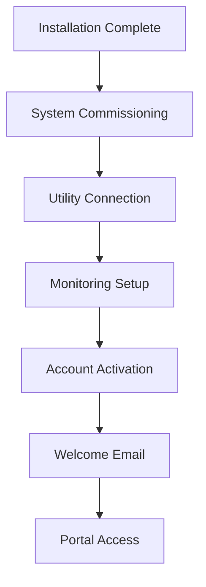

# ZOE Solar - User Guides Documentation
*Comprehensive User Guides for Customers, Partners, and Internal Teams*

## 📋 Table of Contents

1. [Customer Quick Start Guide](#customer-quick-start-guide)
2. [Solar System Owner's Manual](#solar-system-owners-manual)
3. [Admin Dashboard Guide](#admin-dashboard-guide)
4. [Partner Portal Guide](#partner-portal-guide)
5. [Mobile App User Guide](#mobile-app-user-guide)
6. [Troubleshooting Guide](#troubleshooting-guide)
7. [Maintenance and Care Guide](#maintenance-and-care-guide)
8. [Energy Optimization Guide](#energy-optimization-guide)
9. [Billing and Account Management](#billing-and-account-management)
10. [Emergency Procedures](#emergency-procedures)

---

## 🚀 Customer Quick Start Guide

### Welcome to Your Solar Journey!

**Congratulations on choosing ZOE Solar!** This guide will help you get started with your new solar energy system and make the most of your clean energy investment.

### First 24 Hours

**System Activation Process**:


**Immediate Action Items**:
1. **Check Your Email**: Welcome email with account setup instructions
2. **Create Your Account**: Activate your customer portal access
3. **Download Mobile App**: Install the ZOE Solar mobile app
4. **Review System Details**: Confirm system specifications in your portal
5. **Schedule First Check-in**: Book your 30-day performance review

### Account Setup

**Step 1: Customer Portal Registration**
```typescript
interface AccountSetup {
  registrationProcess: {
    emailVerification: 'verify email address';
    passwordCreation: 'create strong password';
    profileCompletion: 'add contact information';
    preferencesSetup: 'set communication preferences';
  };
  initialConfiguration: {
    notificationSettings: 'choose alert preferences';
    reportSchedule: 'select performance report frequency';
    emergencyContacts: 'add backup contact information';
    utilityDetails: 'confirm utility account information';
  };
  securitySetup: {
    twoFactorAuth: 'enable 2FA for enhanced security';
    securityQuestions: 'set account recovery options';
    deviceManagement: 'register trusted devices';
    accessPermissions: 'set family access controls';
  };
}
```

**Step 2: Mobile App Installation**
- **Download**: Available on iOS App Store and Google Play Store
- **Login**: Use the same credentials as your customer portal
- **Enable Notifications**: Allow push notifications for system alerts
- **Dashboard Setup**: Customize your mobile dashboard view
- **Offline Access**: Enable offline mode for basic system information

### Understanding Your Dashboard

**Key Dashboard Elements**:
- **Real-Time Production**: Live energy generation display
- **Current Weather**: Weather conditions affecting production
- **Energy Savings**: Running total of money saved
- **Environmental Impact**: CO₂ reduction statistics
- **System Health**: Overall system status indicator
- **Quick Actions**: Easy access to common tasks

**Performance Metrics Explained**:
- **kWh Produced**: Total energy generated since installation
- **Peak Output**: Highest power output achieved today
- **Efficiency Rate**: System performance compared to ideal conditions
- **Grid Interaction**: Energy imported from/exported to the grid
- **Self-Consumption**: Percentage of solar energy used directly

### First Week Checklist

**Daily Tasks (5 minutes)**:
- [ ] Check system production on mobile app
- [ ] Review any system alerts or notifications
- [ ] Note any unusual weather patterns affecting production

**Weekly Tasks (15 minutes)**:
- [ ] Review weekly performance summary
- [ ] Check energy consumption patterns
- [ ] Compare actual vs. expected production
- [ ] Update any system preferences if needed

**First Month Goals**:
- [ ] Understand system performance patterns
- [ ] Identify optimal energy usage times
- [ ] Set up energy usage alerts and notifications
- [ ] Complete customer satisfaction survey
- [ ] Schedule 30-day performance review call

---

## 🔧 Solar System Owner's Manual

### System Overview

**Your ZOE Solar System Components**:
```typescript
interface SystemComponents {
  solarPanels: {
    type: 'high-efficiency monocrystalline';
    quantity: 'varies by system size';
    warranty: '25-year performance guarantee';
    expectedLifespan: '30+ years';
  };
  inverter: {
    type: 'string inverter or microinverters';
    function: 'converts DC to AC power';
    warranty: '10-25 years depending on model';
    monitoring: 'built-in performance tracking';
  };
  mountingSystem: {
    type: 'roof-mounted or ground-mounted';
    materials: 'aluminum or stainless steel';
    windRating: 'engineered for local wind loads';
    warranty: '10-20 years';
  };
  monitoringSystem: {
    hardware: 'production meter and communication gateway';
    software: 'cloud-based performance tracking';
    features: 'real-time data and historical analysis';
    access: 'web portal and mobile app';
  };
}
```

### Understanding Solar Energy Production

**How Solar Panels Work**:
1. **Sunlight Absorption**: Photovoltaic cells convert sunlight to DC electricity
2. **Power Conversion**: Inverter changes DC electricity to AC for home use
3. **Power Distribution**: Electricity powers your home appliances
4. **Grid Interaction**: Excess energy flows to utility grid for credits
5. **Monitoring System**: Tracks production and performance data

**Factors Affecting Production**:
- **Sunlight Intensity**: Clear, sunny days produce maximum energy
- **Temperature**: Moderate temperatures (15-25°C) are optimal
- **Shading**: Even partial shading can significantly reduce output
- **Panel Orientation**: South-facing panels produce the most energy
- **System Age**: Production gradually decreases over time (degradation)

**Seasonal Production Patterns**:
- **Summer**: Highest production due to longer daylight hours
- **Spring/Fall**: Moderate production with good sun angle
- **Winter**: Lower production due to shorter days and lower sun angle

### Daily Operations

**Morning Routine (6:00 AM - 9:00 AM)**:
- System automatically activates at sunrise
- Production gradually increases as sun rises
- Monitor initial production levels
- Check weather forecast for the day

**Peak Production (9:00 AM - 3:00 PM)**:
- Maximum energy generation during midday hours
- Ideal time for high-energy consumption activities
- Monitor system efficiency and performance
- Track energy exports to the grid

**Evening Routine (3:00 PM - Sunset)**:
- Production gradually decreases as sun sets
- System shuts down automatically at sunset
- Review daily performance summary
- Check for any system alerts or issues

### Energy Management Strategies

**Time-of-Use Optimization**:
```typescript
interface EnergyOptimization {
  peakHours: {
    timeWindow: 'typically 4:00 PM - 9:00 PM';
    costImpact: 'highest electricity rates';
    strategy: 'use stored energy or grid power during peaks';
    solarLimitation: 'minimal solar production during evening peaks';
  };
  offPeakHours: {
    timeWindow: 'typically 9:00 PM - 4:00 PM';
    costBenefit: 'lowest electricity rates';
    strategy: 'schedule high-energy activities during these hours';
    solarMaximization: 'align consumption with solar production';
  };
  shoulderHours: {
    timeWindow: 'transition periods between peak and off-peak';
    moderateRates: 'intermediate electricity pricing';
    flexibleScheduling: 'ideal for discretionary energy use';
    solarMatching: 'good balance of solar and consumption';
  };
}
```

**Smart Energy Usage Tips**:
- **Run Appliances During Peak Production**: Use washing machines, dishwashers, and vacuum cleaners between 10 AM and 2 PM
- **Pre-Cooling**: Air condition your home during midday to reduce evening peak usage
- **Pre-Heating**: Heat water during the day for evening use
- **EV Charging**: Charge electric vehicles during peak solar production hours
- **Pool Equipment**: Run pool pumps and cleaners during daylight hours

### Understanding Your Monitoring Data

**Key Performance Indicators**:
- **Daily Production**: Total energy generated each day
- **Production vs. Consumption**: Comparison of energy produced vs. used
- **Grid Import/Export**: Energy purchased from or sold to the utility
- **System Efficiency**: Actual performance vs. expected performance
- **Weather Impact**: How weather conditions affect production

**Performance Alerts**:
- **Low Production**: Unusually low energy generation
- **System Offline**: Inverter or monitoring system not communicating
- **Grid Connection Issues**: Problems with utility interconnection
- **Weather Events**: Extreme weather affecting system performance
- **Maintenance Required**: Scheduled maintenance reminders

---

## 🎛️ Admin Dashboard Guide

### Dashboard Overview

**Administrator Portal Introduction**:
The ZOE Solar Admin Dashboard provides comprehensive management tools for monitoring customer installations, managing business operations, and analyzing performance metrics across your solar portfolio.

**Login and Security**:
- **Secure Access**: Multi-factor authentication required
- **Role-Based Permissions**: Access levels based on job function
- **Session Management**: Automatic logout after inactivity
- **Audit Trail**: Complete logging of all administrative actions

**Main Dashboard Layout**:
```typescript
interface AdminDashboard {
  topNavigation: {
    dashboard: 'system overview and key metrics';
    customers: 'customer account management';
    installations: 'installation project tracking';
    monitoring: 'system performance monitoring';
    reports: 'business intelligence and analytics';
    settings: 'system configuration and preferences';
  };
  sidebarMenu: {
    overview: 'real-time business metrics';
    installations: 'installation management';
    customers: 'customer relationship management';
    support: 'customer service tools';
    billing: 'financial management';
    settings: 'administrative configuration';
  };
  mainContent: {
    keyMetrics: 'performance indicators and KPIs';
    recentActivity: 'latest system events and updates';
    charts: 'visual data representation';
    quickActions: 'frequently used functions';
  };
}
```

### Customer Management

**Customer Account Administration**:
- **Customer Search**: Find customers by name, email, phone, or system ID
- **Account Details**: View complete customer profiles and system information
- **Contact Management**: Update customer contact information and preferences
- **Account Status**: Manage active, inactive, and suspended accounts
- **Communication History**: Track all customer interactions

**Customer Account Details Page**:
```typescript
interface CustomerAccount {
  personalInformation: {
    name: 'customer full name';
    contact: 'phone, email, address';
    emergencyContacts: 'backup contact information';
    communicationPreferences: 'notification settings';
  };
  systemInformation: {
    installationDate: 'system commissioning date';
    systemSize: 'total system capacity in kW';
    components: 'detailed equipment list';
    performanceHistory: 'historical production data';
  };
  financialInformation: {
    contractDetails: 'original agreement terms';
    paymentHistory: 'all transactions and payments';
    warrantyStatus: 'active warranty coverage';
    serviceContracts: 'maintenance and service agreements';
  };
  supportHistory: {
    serviceTickets: 'all support requests and resolutions';
    maintenanceRecords: 'scheduled and completed maintenance';
    communications: 'all customer interactions';
    satisfactionScores: 'customer feedback and ratings';
  };
}
```

### Installation Management

**Project Tracking Dashboard**:
- **Active Installations**: Currently ongoing installation projects
- **Scheduled Work**: Upcoming installations and maintenance
- **Completed Projects**: Recently finished installations
- **Project Pipeline**: Future installation opportunities
- **Resource Allocation**: Crew and equipment scheduling

**Installation Project Details**:
```typescript
interface InstallationProject {
  projectOverview: {
    projectName: 'customer name and system details';
    projectManager: 'assigned project manager';
    installationCrew: 'assigned installation team';
    timeline: 'project start and completion dates';
    status: 'current project phase and progress';
  };
  technicalDetails: {
    systemDesign: 'approved system specifications';
    equipmentList: 'materials and components required';
    installationPlan: 'step-by-step installation process';
    qualityChecklists: 'inspection and testing procedures';
  };
  projectManagement: {
    schedule: 'detailed project timeline with milestones';
    budget: 'cost breakdown and tracking';
    resources: 'crew, equipment, and material allocation';
    risks: 'potential issues and mitigation strategies';
  };
  documentation: {
    permits: 'building and electrical permits';
    contracts: 'customer agreements and supplier contracts';
    photos: 'site photos and installation progress';
    inspections: 'completed inspection reports and approvals';
  };
}
```

### System Monitoring

**Performance Monitoring Overview**:
- **Portfolio Summary**: Overview of all managed systems
- **Alert Management**: Active system alerts and notifications
- **Performance Analytics**: System efficiency and production trends
- **Maintenance Scheduling**: Preventive maintenance planning
- **Issue Resolution**: Tracking and resolving system problems

**Monitoring Dashboard Features**:
```typescript
interface SystemMonitoring {
  portfolioOverview: {
    totalSystems: 'number of managed installations';
    totalCapacity: 'combined system capacity in MW';
    dailyProduction: 'total energy produced today';
    performanceIndex: 'overall portfolio efficiency';
  };
  alertManagement: {
    activeAlerts: 'current system issues requiring attention';
    alertHistory: 'historical alert data and resolution';
    escalationRules: 'automatic alert routing and escalation';
    notificationSettings: 'alert delivery preferences';
  };
  performanceAnalytics: {
    productionTrends: 'historical performance analysis';
    efficiencyMetrics: 'system vs. expected performance';
    weatherCorrelation: 'impact of weather on production';
    degradationAnalysis: 'long-term performance decline';
  };
}
```

### Reporting and Analytics

**Business Intelligence Dashboard**:
- **Sales Performance**: Revenue tracking and sales metrics
- **Operational Efficiency**: Installation and service productivity
- **Customer Satisfaction**: NPS scores and customer feedback
- **Financial Performance**: Revenue, costs, and profitability
- **Market Trends**: Industry benchmarks and market analysis

**Custom Report Builder**:
- **Data Selection**: Choose specific metrics and time periods
- **Visualization Options**: Various chart types and display options
- **Filtering and Segmentation**: Filter data by region, system type, etc.
- **Export Options**: Download reports in multiple formats
- **Scheduled Reports**: Automated report generation and delivery

### System Configuration

**Administrative Settings**:
- **User Management**: Create and manage user accounts and permissions
- **System Preferences**: Configure platform-wide settings
- **Integration Management**: Manage third-party system connections
- **Notification Rules**: Set up automated alerts and notifications
- **Security Settings**: Configure security policies and access controls

**Security and Compliance**:
- **Access Controls**: Role-based permissions and access restrictions
- **Audit Logs**: Complete tracking of all system activities
- **Data Protection**: GDPR compliance and data privacy controls
- **Backup and Recovery**: Data backup and disaster recovery procedures
- **System Maintenance**: Scheduled maintenance and updates

---

## 🤝 Partner Portal Guide

### Partner Welcome and Overview

**Welcome to the ZOE Solar Partner Program!**
This portal is designed to provide our valued partners with the tools and resources needed to successfully sell, install, and support ZOE Solar systems.

**Partner Benefits**:
- **Dedicated Support**: Direct access to partner support team
- **Marketing Resources**: Co-brandable marketing materials and campaigns
- **Training Programs**: Comprehensive product and installation training
- **Lead Generation**: Access to qualified customer leads
- **Performance Tracking**: Detailed sales and installation analytics

**Portal Navigation**:
```typescript
interface PartnerPortal {
  mainSections: {
    dashboard: 'partner performance overview and key metrics';
    leads: 'customer lead management and assignment';
    sales: 'sales pipeline and opportunity tracking';
    installations: 'installation project management';
    resources: 'marketing materials and documentation';
    training: 'educational resources and certification';
    support: 'technical support and issue resolution';
    account: 'partner profile and commission tracking';
  };
  quickActions: {
    createProposal: 'generate custom solar proposals';
    checkInventory: 'view available equipment and pricing';
    requestSupport: 'submit technical support requests';
    downloadResources: 'access marketing and sales materials';
    scheduleTraining: 'book training sessions and webinars';
  };
}
```

### Lead Management

**Lead Assignment and Management**:
- **Lead Distribution**: Automatic assignment based on territory and expertise
- **Lead Quality**: Qualified leads with customer information and requirements
- **Follow-Up Tracking**: Monitor lead response times and conversion rates
- **Communication History**: Complete record of all customer interactions
- **Performance Metrics**: Lead conversion and closing rate analytics

**Lead Management Workflow**:
```typescript
interface LeadManagement {
  leadReceipt: {
    notificationAlerts: 'instant lead notifications';
    leadDetails: 'customer information and requirements';
    assignmentRules: 'territory and expertise-based routing';
    priorityLevel: 'lead urgency and potential value';
  };
  leadQualification: {
    contactInformation: 'verified customer contact details';
    projectRequirements: 'system size and budget expectations';
    siteFeasibility: 'initial solar feasibility assessment';
    timeline: 'customer decision and installation timeline';
  };
  opportunityTracking: {
    salesStage: 'current position in sales process';
    probability: 'likelihood of conversion to sale';
    nextSteps: 'planned activities and follow-up actions';
    expectedValue: 'potential revenue from opportunity';
  };
}
```

### Sales and Proposal Tools

**Proposal Generation System**:
- **Custom Templates**: Branded proposal templates with partner information
- **System Design**: Integration with design tools for accurate proposals
- **Financial Analysis**: ROI calculations and financing options
- **Document Management**: Electronic signature and proposal tracking
- **Version Control**: Maintain proposal history and revisions

**Proposal Creation Process**:
1. **Customer Information**: Enter customer details and site information
2. **System Design**: Select equipment and design solar array layout
3. **Financial Analysis**: Calculate costs, savings, and ROI projections
4. **Proposal Customization**: Add partner branding and personal messages
5. **Review and Send**: Review proposal details and send to customer

### Installation Management

**Project Tracking Dashboard**:
- **Active Projects**: Currently scheduled installations
- **Installation Calendar**: View and manage installation schedules
- **Resource Planning**: Manage crews, equipment, and materials
- **Quality Assurance**: Track inspection results and approvals
- **Documentation**: Store and manage project documents

**Installation Workflow**:
```typescript
interface InstallationWorkflow {
  projectSetup: {
    contractVerification: 'confirm customer agreement details';
    materialOrdering: 'order required equipment and materials';
    permitApplication: 'submit building and electrical permits';
    crewScheduling: 'assign installation team and schedule work';
  };
  installationExecution: {
    sitePreparation: 'coordinate site access and preparations';
    materialDelivery: 'confirm material delivery and storage';
    installationWork: 'monitor installation progress and quality';
    safetyCompliance: 'ensure safety procedures are followed';
  };
  completionProcess: {
    systemTesting: 'verify system performance and safety';
    utilityConnection: 'coordinate grid interconnection';
    finalInspection: 'schedule and pass final inspections';
    customerHandover: 'complete customer training and system activation';
  };
}
```

### Training and Certification

**Partner Training Programs**:
- **Product Training**: Detailed product knowledge and specifications
- **Sales Training**: Effective sales techniques and proposal creation
- **Installation Training**: Best practices and quality standards
- **Safety Training**: OSHA compliance and job site safety
- **Customer Service**: Support procedures and customer satisfaction

**Certification Levels**:
- **Certified Installer**: Basic installation certification
- **Master Installer**: Advanced installation and troubleshooting
- **Certified Sales Professional**: Sales and proposal expertise
- **System Designer**: Advanced system design and optimization

**Training Resources**:
- **Online Courses**: Self-paced training modules and videos
- **Live Webinars**: Interactive training sessions with experts
- **In-Person Workshops**: Hands-on training and certification events
- **Documentation**: Comprehensive training manuals and guides
- **Knowledge Base**: Searchable database of technical information

### Performance Tracking

**Partner Performance Dashboard**:
- **Sales Metrics**: Track leads, proposals, and closed deals
- **Installation Quality**: Monitor installation performance and customer satisfaction
- **Commission Tracking**: View earned commissions and payment status
- **Customer Feedback**: Monitor customer satisfaction and reviews
- **Benchmarking**: Compare performance against other partners

**Key Performance Indicators**:
```typescript
interface PartnerPerformance {
  salesMetrics: {
    leadConversionRate: 'percentage of leads converted to sales';
    averageDealSize: 'mean value of closed deals';
    salesCycleLength: 'average time from lead to close';
    proposalWinRate: 'percentage of proposals that result in sales';
  };
  installationMetrics: {
    installationTime: 'average duration of installation projects';
    firstTimeRight: 'percentage passing inspection on first attempt';
    customerSatisfaction: 'customer ratings and feedback scores';
    warrantyClaims: 'post-installation warranty claim rates';
  };
  businessMetrics: {
    revenueGrowth: 'period-over-period revenue increase';
    customerRetention: 'repeat business and referral rates';
    marketShare: 'regional market presence and penetration';
    profitability: 'profit margins and overall business health';
  };
}
```

---

## 📱 Mobile App User Guide

### Getting Started

**App Installation and Setup**:
- **Download**: Available on iOS App Store and Google Play Store
- **System Requirements**: iOS 12+ or Android 8+, 50MB storage space
- **Account Setup**: Use same credentials as customer portal
- **Enable Notifications**: Allow push notifications for alerts
- **Biometric Login**: Set up fingerprint or face recognition login

**Home Screen Navigation**:
```typescript
interface MobileAppNavigation {
  bottomTabBar: {
    dashboard: 'main system overview and performance';
    energy: 'detailed energy production and consumption';
    alerts: 'system alerts and notifications';
    support: 'help resources and contact options';
    profile: 'account settings and preferences';
  };
  topMenu: {
    notifications: 'alert center with priority indicators';
    refresh: 'manual data refresh and sync status';
    settings: 'app configuration and preferences';
    help: 'in-app support and FAQ access';
  };
  quickActions: {
    reportIssue: 'quickly report system problems';
    scheduleMaintenance: 'book service appointments';
    contactSupport: 'direct support team contact';
    viewReports: 'access performance reports';
  };
}
```

### Dashboard Features

**Real-Time Monitoring**:
- **Current Production**: Live power output with animated display
- **Today's Summary**: Daily energy production and consumption
- **Weather Conditions**: Current weather and forecast information
- **System Health**: Overall system status with color-coded indicators
- **Quick Stats**: Key performance metrics at a glance

**Interactive Dashboard Elements**:
- **Production Graphs**: Swipe through different time periods (hourly, daily, weekly)
- **Energy Flow**: Visual representation of energy production and consumption
- **Performance Gauge**: System efficiency compared to expected performance
- **Savings Tracker**: Running total of energy cost savings
- **Environmental Impact**: CO₂ reduction and environmental benefits

### Energy Management

**Energy Usage Analytics**:
```typescript
interface EnergyAnalytics {
  consumptionAnalysis: {
    householdUsage: 'total home energy consumption';
    applianceBreakdown: 'energy usage by major appliances';
    timePatterns: 'consumption patterns throughout the day';
    seasonalVariation: 'monthly and seasonal usage trends';
  };
  productionAnalysis: {
    solarGeneration: 'energy produced by solar system';
    efficiencyMetrics: 'system performance vs. expectations';
    weatherImpact: 'effect of weather conditions on production';
    degradationTracking: 'long-term performance decline';
  };
  optimizationSuggestions: {
    usageShifts: 'recommendations for optimal energy usage times';
    efficiencyImprovements: 'tips for reducing energy consumption';
    storageOptimization: 'battery charging and discharging strategies';
    ratePlanOptimization: 'recommendations for best utility rate plans';
  };
}
```

**Energy Saving Tips**:
- **Peak Hour Optimization**: Reduce consumption during expensive peak hours
- **Solar Alignment**: Run high-energy appliances during peak production
- **Weather Planning**: Adjust usage based on weather forecasts
- **Seasonal Adjustments**: Optimize usage for seasonal production variations
- **Smart Home Integration**: Connect with smart home devices for automation

### Alerts and Notifications

**Alert Types and Priority Levels**:
```typescript
interface AlertSystem {
  criticalAlerts: {
    systemOffline: 'inverter or monitoring system not communicating';
    safetyIssues: 'detected electrical or safety problems';
    productionFailure: 'complete system failure or shutdown';
    emergencyShutdown: 'automatic safety shutdown activated';
  };
  warningAlerts: {
    lowProduction: 'unusually low energy generation';
    maintenanceDue: 'scheduled maintenance reminders';
    weatherAlerts: 'severe weather affecting system performance';
    performanceIssues: 'system operating below expected levels';
  };
  informationalAlerts: {
    milestones: 'production milestones and achievements';
    softwareUpdates: 'system software and firmware updates';
    tipsOptimizations: 'energy saving tips and optimization suggestions';
    communityUpdates: 'company news and solar industry updates';
  };
}
```

**Notification Management**:
- **Custom Preferences**: Choose which alerts to receive and how
- **Quiet Hours**: Set do-not-disturb times for non-critical alerts
- **Priority Levels**: Configure alert sensitivity and escalation
- **Multiple Devices**: Receive alerts on phone, tablet, and email
- **Acknowledge Actions**: Mark alerts as acknowledged or resolved

### Support and Troubleshooting

**In-App Support Features**:
- **Guided Troubleshooting**: Step-by-step problem resolution guides
- **System Diagnostics**: Automated system health checks
- **Photo Submission**: Send photos of system components for analysis
- **Live Chat**: Real-time support with customer service team
- **Appointment Scheduling**: Book service appointments directly

**Self-Service Resources**:
- **FAQ Database**: Searchable knowledge base of common questions
- **Video Tutorials**: How-to videos for system operation and maintenance
- **User Manual**: Complete digital version of system documentation
- **Glossary**: Definitions of solar energy terminology
- **Community Forum**: Connect with other solar system owners

---

## 🔧 Troubleshooting Guide

### Common System Issues

**System Not Producing Power**:
*Possible Causes and Solutions*:
- **Check Weather**: Cloudy or rainy conditions reduce production
- **Verify Grid Status**: Power outages affect system operation
- **Check Inverter**: Ensure inverter has power and no error codes
- **Breaker Check**: Verify solar breaker is not tripped
- **Utility Meter**: Confirm meter is running correctly

*When to Call Support*:
- System not producing power for 24+ hours in good weather
- Inverter showing error codes that don't clear
- Multiple components not functioning simultaneously
- Safety indicators or warning lights active

**Low Production Issues**:
*Diagnostic Steps*:
```typescript
interface LowProductionTroubleshooting {
  environmentalFactors: {
    weatherConditions: 'check for persistent clouds or shade';
    seasonalVariation: 'consider seasonal sun angle changes';
    temperatureEffects: 'high temperatures can reduce efficiency';
    atmosphericConditions: 'air pollution, dust, or pollen effects';
  };
  systemFactors: {
    panelCondition: 'check for dirt, debris, or damage';
    shadingIssues: 'new tree growth or construction causing shade';
    inverterPerformance: 'verify inverter is functioning correctly';
    wiringConnections: 'loose or damaged electrical connections';
  };
  monitoringAccuracy: {
    sensorCalibration: 'monitoring system may need recalibration';
    dataSync: 'ensure app and system data are synchronized';
    softwareUpdates: 'check for available system updates';
    communicationErrors: 'verify system communication is working';
  };
}
```

**Communication Errors**:
- **Internet Connection**: Verify home internet is working
- **Router Status**: Check WiFi router is powered and functioning
- **Signal Strength**: Ensure monitoring gateway has good signal
- **Power Cycling**: Restart inverter and monitoring equipment
- **Network Settings**: Verify network configuration hasn't changed

### Emergency Procedures

**Safety First - Emergency Shutdown**:
```typescript
interface EmergencyProcedures {
  immediateShutdown: {
    electricalSafety: 'do not touch any electrical equipment';
    emergencySwitches: 'use system emergency shutdown switches';
    utilityNotification: 'contact utility company if needed';
    evacuationPlan: 'follow site-specific emergency procedures';
  };
  specificEmergencies: {
    fire: 'evacuate immediately and call emergency services';
    electricalShock: 'do not touch person, call emergency services';
    severeWeather: 'secure outdoor equipment and seek shelter';
    powerOutage: 'wait for utility to restore power safely';
  };
  postEmergency: {
    damageAssessment: 'document any damage with photos';
    professionalInspection: 'schedule professional system inspection';
    insuranceClaims: 'contact insurance provider if damage occurred';
    systemTesting: 'ensure system is safe before restarting';
  };
}
```

**Emergency Contact Information**:
- **Emergency Services**: 112 (European Emergency Number)
- **ZOE Solar Emergency**: +49 (0) 30 12345678 (24/7 support line)
- **Utility Company**: Local utility emergency number
- **Electrical Inspector**: Local electrical authority contact
- **Fire Department: Local fire department emergency number

### Performance Optimization

**System Efficiency Improvements**:
- **Panel Cleaning**: Clean panels 2-4 times per year or as needed
- **Vegetation Management**: Trim trees and vegetation causing shade
- **System Monitoring**: Regular review of performance data
- **Weather Awareness**: Understand weather impact on production
- **Usage Optimization**: Align energy usage with production patterns

**Seasonal Optimization**:
```typescript
interface SeasonalOptimization {
  summerOptimization: {
    panelCleaning: 'remove pollen and dust buildup';
    ventilation: 'ensure proper inverter ventilation';
    heatManagement: 'monitor for overheating issues';
    stormPreparedness: 'secure system for severe weather';
  };
  winterOptimization: {
    snowRemoval: 'safely remove snow from panels if possible';
    angleAdjustment: 'optimize for lower sun angle (if adjustable)';
    shortDays: 'plan for reduced production hours';
    batteryManagement: 'optimize battery usage for shorter days';
  };
  springMaintenance: {
    thoroughInspection: 'check for winter damage';
    cleaningPreparation: 'prepare for pollen season';
    vegetationGrowth: 'trim new tree growth early';
    systemTesting: 'verify all systems after winter';
  };
  fallPreparation: {
    leafRemoval: 'clear fallen leaves from panels';
    stormReadiness: 'prepare for winter storms';
    performanceReview: 'analyze yearly performance';
    maintenancePlanning: 'schedule any needed maintenance';
  };
}
```

---

## 🛠️ Maintenance and Care Guide

### Routine Maintenance Schedule

**Monthly Visual Inspection (5-10 minutes)**:
- **Panel Condition**: Check for visible damage, cracks, or discoloration
- **Debris Accumulation**: Look for leaves, branches, or other debris
- **Mounting System**: Verify racking appears secure and undamaged
- **Wire Management**: Check for loose or damaged wiring
- **Vegetation Growth**: Monitor for new shading from tree growth

**Quarterly Performance Review (15-30 minutes)**:
- **Production Analysis**: Review monthly production vs. expectations
- **Weather Impact Assessment**: Understand weather effect on performance
- **Alert Review**: Address any system alerts or warnings
- **Cleaning Schedule**: Plan panel cleaning if production appears reduced
- **Documentation**: Record observations and maintenance actions

**Annual Professional Inspection (2-4 hours)**:
```typescript
interface AnnualInspection {
  electricalSystem: {
    connectionTightness: 'torque test all electrical connections';
    wiringCondition: 'inspect for wear, damage, or deterioration';
    groundingSystem: 'verify proper grounding and bonding';
    conduitProtection: 'check conduit integrity and protection';
  };
  mechanicalSystem: {
    mountingIntegrity: 'inspect racking and mounting hardware';
    roofAttachments: 'check roof penetrations and waterproofing';
    structuralSecurity: 'verify system is properly secured';
    windLoadCompliance: 'ensure system meets wind load requirements';
  };
  performanceTesting: {
    outputVerification: 'measure actual vs. expected output';
    efficiencyAnalysis: 'calculate system efficiency and performance';
    inverterTesting: 'verify inverter operation and functions';
    monitoringAccuracy: 'calibrate monitoring equipment';
  };
}
```

### Panel Cleaning Procedures

**Safe Cleaning Methods**:
- **Timing**: Clean early morning or late afternoon to avoid thermal shock
- **Water Quality**: Use deionized or distilled water to prevent mineral deposits
- **Cleaning Tools**: Soft brush, squeegee, or non-abrasive cloth
- **Cleaning Solution**: Mild soap solution if necessary (avoid harsh chemicals)
- **Safety First**: Never walk on roof or panels without proper safety equipment

**Cleaning Frequency Guidelines**:
- **Dusty Areas**: Clean panels every 1-2 months
- **Moderate Areas**: Clean panels every 3-4 months
- **Low Dust Areas**: Clean panels every 6 months
- **After Major Events**: Clean after storms, construction, or nearby fires
- **Seasonal Cleaning**: Additional cleaning during high pollen seasons

**Professional Cleaning Services**:
- **Safety Equipment**: Professionals have appropriate safety gear
- **Specialized Tools**: Access to professional cleaning equipment
- **Water Treatment**: Proper water filtration and treatment systems
- **Insurance Coverage**: Fully insured for rooftop work
- **Efficiency Testing**: Can measure cleaning effectiveness

### Vegetation Management

**Shade Prevention Strategies**:
```typescript
interface VegetationManagement {
  regularMaintenance: {
    treeTrimming: 'prune trees threatening solar access';
    growthMonitoring: 'track vegetation growth patterns';
    seasonalPlanning: 'schedule trimming for optimal results';
    professionalServices: 'hire certified arborists when needed';
  };
  futurePlanning: {
    speciesSelection: 'choose low-growing trees near solar arrays';
    placementStrategy: 'plan tree locations to avoid future shading';
    rootManagement: 'consider root growth impact on foundations';
    landscapeDesign: 'incorporate solar access into landscape design';
  };
  monitoringTools: {
    shadeAnalysis: 'regular shading assessment throughout the year';
    sunPathTracking: 'monitor seasonal sun path changes';
    performanceCorrelation: 'relate performance drops to vegetation growth';
    documentation: 'photographic record of vegetation changes';
  };
}
```

**Maintenance Schedule**:
- **Spring**: Trim trees before growing season begins
- **Summer**: Monitor for rapid growth during peak growing months
- **Fall**: Remove fallen leaves and prepare for winter
- **Winter**: Assess tree structure for winter safety
- **After Storms**: Check for damage and immediate hazards

### Long-Term Care Planning

**System Degradation Management**:
- **Performance Tracking**: Monitor annual degradation rates (typically 0.5-1%)
- **Component Lifespan**: Plan for inverter replacement (10-15 years)
- **Battery Management**: Monitor battery health and capacity
- **Technology Upgrades**: Consider system improvements and enhancements
- **Warranty Tracking**: Maintain warranty documentation and deadlines

**Budget Planning for Future Costs**:
```typescript
interface LongTermPlanning {
  replacementPlanning: {
    inverterReplacement: 'budget for inverter replacement in 10-15 years';
    batteryUpgrades: 'plan for battery system upgrades or expansion';
    monitoringEquipment: 'budget for monitoring system updates';
    electricalUpgrades: 'plan for electrical system improvements';
  };
  maintenanceBudget: {
    professionalInspections: 'annual professional inspection costs';
    cleaningServices: 'regular panel cleaning service costs';
    vegetationManagement: 'ongoing tree and landscape maintenance';
    emergencyRepairs: 'budget for unexpected repair needs';
  };
  efficiencyImprovements: {
    technologyUpgrades: 'budget for new technology adoption';
    systemExpansion: 'plan for future system capacity increases';
    smartHomeIntegration: 'budget for home automation integration';
    energyStorage: 'plan for battery storage additions';
  };
}
```

---

## ⚡ Energy Optimization Guide

### Understanding Your Energy Usage

**Energy Consumption Analysis**:
```typescript
interface EnergyUsageAnalysis {
  householdProfile: {
    homeSize: 'square footage and number of rooms';
    occupancy: 'number of residents and daily schedules';
    appliances: 'major energy-consuming appliances';
    lifestyle: 'energy usage patterns and habits';
  };
  consumptionPatterns: {
    dailyProfile: 'hourly energy usage throughout the day';
    seasonalVariation: 'monthly and seasonal usage changes';
    peakUsage: 'highest consumption periods and causes';
    baseLoad: 'minimum continuous energy consumption';
  };
  costAnalysis: {
    rateStructure: 'understanding utility rate plans';
    timeOfUse: 'different rates for different times';
    demandCharges: 'additional fees for high peak usage';
    netMetering: 'credits for excess solar production';
  };
}
```

**Major Energy Consumers**:
- **Heating and Cooling**: 40-50% of home energy usage
- **Water Heating**: 15-20% of energy consumption
- **Appliances**: 20-30% including refrigerator, washer, dryer
- **Lighting**: 10-15% of home energy usage
- **Electronics**: 5-10% including computers and entertainment

### Smart Energy Strategies

**Time-of-Use Optimization**:
- **Peak Hours**: Typically 4 PM - 9 PM with highest rates
- **Off-Peak Hours**: Lowest rates, often overnight and midday
- **Shoulder Hours**: Intermediate rates between peak and off-peak
- **Solar Alignment**: Maximize self-consumption during peak production
- **Battery Strategy**: Store excess energy for use during peak hours

**Smart Scheduling Strategies**:
```typescript
interface SmartScheduling {
  applianceScheduling: {
    washingMachine: 'run during 10 AM - 2 PM for solar alignment';
    dishwasher: 'delay start until midday solar production';
    ovenStovetop: 'use during off-peak morning hours';
    airConditioning: 'pre-cool during midday, reduce during peaks';
  };
  waterHeating: {
    heatPumpWaterHeater: 'schedule heating during solar production';
    traditionalWaterHeater: 'use timer to align with solar hours';
    recirculationPump: 'program to run during off-peak periods';
    temperatureSetpoints: 'optimize temperature for efficiency';
  };
  electricVehicle: {
    chargingSchedule: 'charge during peak solar production';
    chargeRate: 'adjust charging rate based on solar availability';
    batteryBuffer: 'use vehicle battery for home energy storage';
    smartCharging: 'integrate with time-of-use rate optimization';
  };
}
```

### Energy Storage Optimization

**Battery Management Strategies**:
- **Self-Consumption**: Store excess solar for evening use
- **Time Shifting**: Charge during off-peak, discharge during peak
- **Backup Power**: Reserve capacity for power outages
- **Grid Services**: Participate in utility demand response programs
- **Economic Optimization**: Maximize financial return from battery operation

**Battery Operating Modes**:
```typescript
interface BatteryManagement {
  selfConsumptionMode: {
    operation: 'store excess solar for evening use';
    benefits: 'maximize solar energy utilization';
    settings: 'charge when solar > house load';
    efficiency: 'typically 85-90% round-trip efficiency';
  };
  timeOfUseMode: {
    operation: 'buy low, sell high energy arbitrage';
    benefits: 'reduce electricity costs during peak hours';
    settings: 'charge during off-peak, discharge during peak';
    optimization: 'requires utility time-of-use rate plan';
  };
  backupMode: {
    operation: 'reserve capacity for power outages';
    benefits: 'ensure critical loads stay powered';
    settings: 'maintain minimum reserve level';
    priority: 'essential circuits only during extended outages';
  };
  gridServicesMode: {
    operation: 'participate in utility grid support programs';
    benefits: 'earn revenue from grid services';
    settings: 'follow utility dispatch signals';
    requirements: 'utility participation and advanced inverter';
  };
}
```

### Home Automation Integration

**Smart Home Energy Management**:
- **Automated Scheduling**: Integrate with smart thermostats and appliances
- **Load Management**: Automatically reduce non-essential loads during peaks
- **Energy Monitoring**: Real-time energy usage visibility and control
- **Predictive Optimization**: AI-driven energy usage optimization
- **Remote Control**: Manage home energy usage from anywhere

**Integration Benefits**:
```typescript
interface SmartHomeIntegration {
  automatedEfficiency: {
    thermostatIntegration: 'coordinate HVAC with solar production';
    applianceControl: 'automate appliance scheduling based on solar';
    lightingOptimization: 'adjust lighting based on natural daylight';
    shadeManagement: 'automated blinds for temperature control';
  };
  energyMonitoring: {
    realTimeData: 'detailed energy usage and production data';
    deviceLevel: 'monitor individual appliance energy consumption';
    historicalAnalysis: 'track usage patterns and trends';
    alertSystems: 'notifications for unusual energy usage';
  };
  predictiveControl: {
    weatherIntegration: 'adjust strategies based on weather forecasts';
    learningAlgorithms: 'AI optimizes based on household patterns';
    marketIntegration: 'respond to energy price changes and demand';
    predictiveMaintenance: 'anticipate equipment maintenance needs';
  };
}
```

---

## 💳 Billing and Account Management

### Understanding Your Solar Investment

**Financial Overview Dashboard**:
- **System Cost**: Total investment including equipment and installation
- **Incentives Applied**: Government rebates, tax credits, and other incentives
- **Monthly Savings**: Reduction in electricity bills
- **Payback Period**: Time to recover initial investment through savings
- **Return on Investment**: Financial return percentage over system lifetime

**Cost Breakdown Analysis**:
```typescript
interface FinancialBreakdown {
  initialInvestment: {
    equipmentCosts: 'solar panels, inverter, mounting system';
    installationCosts: 'labor, permits, inspection fees';
    softCosts: 'design, engineering, administrative costs';
    financingCosts: 'loan interest or financing fees';
  };
  financialIncentives: {
    taxCredits: 'federal and state tax benefits';
    rebates: 'utility and government rebates';
    grants: 'available renewable energy grants';
    srecs: 'solar renewable energy credits';
  };
  ongoingValue: {
    energySavings: 'monthly electricity bill reduction';
    srecRevenue: 'income from selling solar credits';
    netMeteringCredits: 'utility credits for excess production';
    propertyValueIncrease: 'home value appreciation from solar';
  };
}
```

### Bill Management and Payment

**Monthly Statements**:
- **Production Summary**: Monthly energy production and system performance
- **Energy Savings**: Detailed breakdown of electricity cost savings
- **Net Metering**: Credits from utility for excess energy production
- **Financing Payments**: Loan or lease payments (if applicable)
- **Service Fees**: Monitoring and maintenance service charges

**Payment Options**:
- **Automatic Payments**: Set up automatic monthly payments
- **Online Portal**: Pay bills through customer account portal
- **Mobile App**: Make payments through the ZOE Solar mobile app
- **Bank Transfer**: Direct bank transfer for large payments
- **Phone Payment**: Pay by phone with customer service representative

### Tax and Incentive Management

**Available Solar Incentives**:
```typescript
interface SolarIncentives {
  federalIncentives: {
    investmentTaxCredit: '30% federal tax credit for solar systems';
    acceleratedDepreciation: 'MACRS depreciation for businesses';
    usdaGrants: 'rural development grants for renewable energy';
  };
  stateIncentives: {
    stateTaxCredits: 'varies by state, up to 25% additional credit';
    cashRebates: 'upfront rebates based on system size';
    performancePayments: 'ongoing payments for solar production';
  };
  utilityIncentives: {
    netMetering: 'full retail credit for excess production';
    srecProgram: 'sale of solar renewable energy credits';
    demandResponse: 'payments for reducing grid demand during peaks';
  };
  localIncentives: {
    propertyTaxExemptions: 'exclude solar from property tax assessment';
    permitFeeWaivers: 'reduced or waived permit fees';
    expeditedPermitting: 'fast-track permit approval process';
  };
}
```

### Account Management Features

**Customer Portal Account Management**:
- **Profile Information**: Update contact details and preferences
- **Billing Information**: Manage payment methods and billing address
- **System Details**: View equipment specifications and warranty information
- **Document Access**: Download contracts, warranties, and system documents
- **Service History**: Track all maintenance and service activities

**Privacy and Security**:
- **Data Protection**: GDPR-compliant data handling and storage
- **Account Security**: Two-factor authentication and secure login
- **Privacy Settings**: Control how your data is used and shared
- **Access Permissions**: Set up family or trusted advisor access
- **Data Portability**: Export your data and system information

---

## 🚨 Emergency Procedures

### System Emergency Response

**Immediate Safety Procedures**:
1. **Assess the Situation**: Determine if there is immediate danger
2. **Ensure Personal Safety**: Keep away from damaged equipment
3. **Emergency Shutdown**: Use system emergency shutdown if safe to do so
4. **Call for Help**: Contact emergency services if needed
5. **Secure the Area**: Keep others away from potential hazards

**Emergency Shutdown Process**:
```typescript
interface EmergencyShutdown {
  acDisconnection: {
    mainBreaker: 'switch off main circuit breaker for solar system';
    inverterSwitch: 'turn off AC disconnect switch near inverter';
    utilityIsolation: 'ensure system is isolated from utility grid';
  };
  dcDisconnection: {
    pvDisconnect: 'switch off DC disconnect from solar panels';
    combinerBox: 'turn off combiner box disconnect if present';
    voltageVerification: 'confirm no DC voltage is present';
  };
  safetyProcedures: {
    lockoutTagout: 'apply lockout/tagout devices if qualified';
    warningSigns: 'post warning signs if system is down';
    areaIsolation: 'keep unauthorized personnel away';
  };
}
```

### Specific Emergency Scenarios

**Fire Emergency**:
- **Immediate Action**: Evacuate area and call fire department
- **Do Not Touch**: Never touch electrical equipment during fire
- **Emergency Services**: Inform firefighters about solar system location
- **Ventilation**: Do not attempt to ventilate battery areas
- **Re-entry**: Wait for professional clearance before re-entering

**Electrical Shock Emergency**:
- **Do Not Touch**: Never touch person in contact with electricity
- **Power Off**: Shut off power source if safe to do so
- **Call Emergency**: Dial emergency services immediately
- **First Aid**: Provide CPR if trained and necessary
- **Medical Attention**: Always seek medical evaluation

**Severe Weather Emergency**:
- **Storm Preparation**: Secure loose objects and outdoor equipment
- **System Shutdown**: Consider shutting down system before severe storms
- **Lightning Protection**: Stay away from system during lightning
- **Wind Damage**: inspect for damage after high winds
- **Safety Inspection**: Professional inspection after major weather events

### Post-Emergency Procedures

**Damage Assessment and Documentation**:
```typescript
interface PostEmergencyActions {
  safetyVerification: {
    professionalInspection: 'schedule qualified system inspection';
    damageAssessment: 'document all visible and suspected damage';
    safetyClearance: 'obtain professional clearance before restarting';
    insuranceClaims: 'contact insurance provider for damage coverage';
  };
  systemRestoration: {
    repairPlanning: 'develop comprehensive repair plan';
    qualifiedTechnicians: 'hire only certified solar technicians';
    componentReplacement: 'replace damaged components with approved equipment';
    systemTesting: 'thorough testing before returning to service';
  };
  preventionMeasures: {
    rootCauseAnalysis: 'investigate cause of emergency';
    systemUpgrades: 'consider improvements to prevent recurrence';
    maintenanceUpdates: 'update maintenance procedures';
    emergencyPlan: 'review and improve emergency response plan';
  };
}
```

**Insurance and Warranty Claims**:
- **Immediate Notification**: Contact insurance provider within 24 hours
- **Documentation**: Take photos and document all damage
- **Professional Reports**: Obtain detailed damage assessment reports
- **Repair Estimates**: Get multiple repair quotes if possible
- **Warranty Coverage**: Check manufacturer warranties for component coverage

### Emergency Contact Information

**24/7 Emergency Contacts**:
- **Emergency Services**: 112 (European Union Emergency Number)
- **ZOE Solar Emergency Hotline**: +49 (0) 30 12345678
- **Electrical Emergency**: Local utility emergency number
- **Fire Department**: Local fire department (dial 112)
- **Poison Control**: +49 (0) 30 19240 (if chemical exposure)

**Non-Emergency Contacts**:
- **Customer Support**: +49 (0) 30 12345679 (business hours)
- **Service Department**: service@zoe-solar.de
- **Technical Support**: technical@zoe-solar.de
- **Billing Department**: billing@zoe-solar.de
- **General Inquiries**: info@zoe-solar.de

**Important Information to Have Ready**:
- **System ID Number**: Located on your installation contract
- **Customer Account Number**: From your billing statements
- **System Address**: Installation location and access information
- **Emergency Contact**: Alternative contact person information
- **Utility Provider**: Local electric utility company information

---

## 📊 Quick Reference Cards

### Daily System Check (5 Minutes)
- [ ] Check mobile app for system status
- [ ] Verify current production levels
- [ ] Review any active alerts
- [ ] Note weather conditions
- [ ] Check for unusual performance patterns

### Monthly System Review (15 Minutes)
- [ ] Review monthly production report
- [ ] Compare to expected performance
- [ ] Check for any maintenance reminders
- [ ] Visual inspection from ground level
- [ ] Update customer preferences if needed

### Quarterly Maintenance (30 Minutes)
- [ ] Detailed performance analysis
- [ ] Clean panels if visibly dirty
- [ ] Trim vegetation if needed
- [ ] Check for shading issues
- [ ] Review energy usage patterns

### Annual Professional Service
- [ ] Schedule professional inspection
- [ ] Electrical system testing
- [ ] Mechanical system verification
- [ ] Performance calibration
- [ ] Documentation update

---

## 🆘 Support Resources

**Self-Service Resources**:
- **Online Knowledge Base**: Comprehensive FAQ and troubleshooting guides
- **Video Library**: Step-by-step video tutorials and system guides
- **Community Forum**: Connect with other ZOE Solar customers
- **System Documentation**: Download complete system manuals
- **Mobile App Support**: In-app help and guided troubleshooting

**Contact Support**:
- **Phone Support**: +49 (0) 30 12345679 (Mon-Fri, 8 AM - 6 PM CET)
- **Email Support**: support@zoe-solar.de (24-hour response time)
- **Live Chat**: Available through customer portal and mobile app
- **Emergency Support**: +49 (0) 30 12345678 (24/7 for emergencies)
- **Schedule Callback**: Request a call back at your convenience

**Service Hours**:
- **Customer Service**: Monday - Friday, 8:00 AM - 6:00 PM CET
- **Technical Support**: Monday - Friday, 8:00 AM - 6:00 PM CET
- **Emergency Service**: 24/7/365 for system emergencies
- **Billing Support**: Monday - Friday, 9:00 AM - 5:00 PM CET
- **Installation Support**: Monday - Saturday, 7:00 AM - 5:00 PM CET

---

*This comprehensive user guide provides detailed information for all aspects of ZOE Solar system ownership, from initial setup through long-term optimization and emergency procedures. Regular reference to these guides will help ensure optimal system performance and customer satisfaction.*